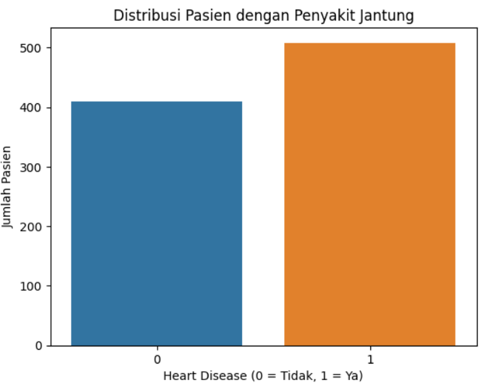
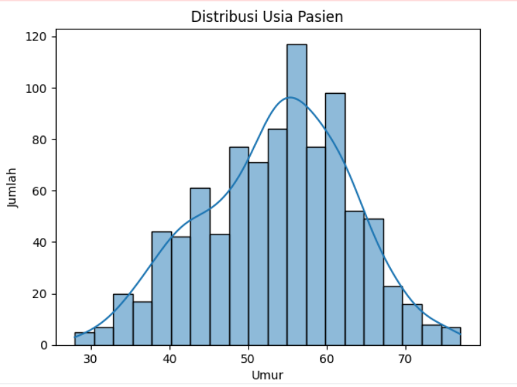
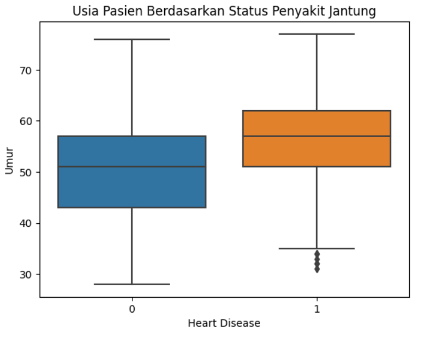
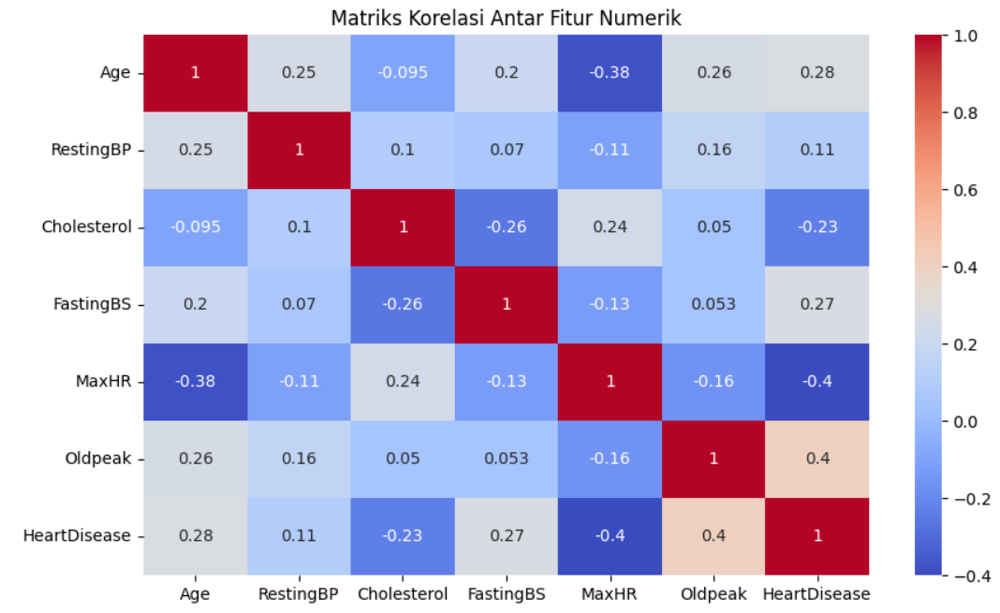
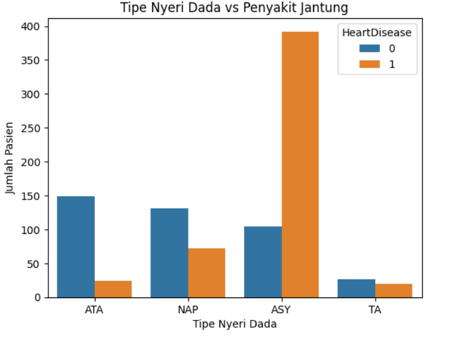
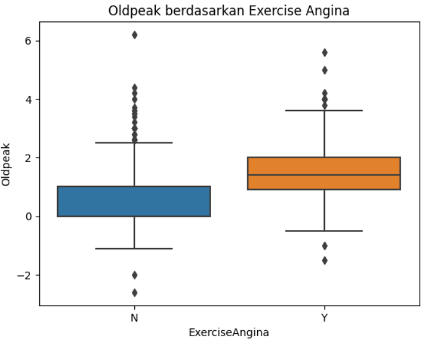

# Laporan Proyek Machine Learning - Muhammad Rizki Putra

## Domain Project / Project Overview
---

#### Judul
Penerapan Algoritma Klasifikasi Machine Learning dalam Memprediksi Risiko Penyakit Jantung

#### Latar Belakang
Penyakit jantung merupakan penyebab utama kematian di seluruh dunia. Berdasarkan data dari World Health Organization (WHO), penyakit kardiovaskular menyebabkan sekitar 17,9 juta kematian setiap tahun, atau sekitar 31% dari total kematian global. Kondisi ini mencerminkan urgensi dalam melakukan deteksi dini untuk mencegah komplikasi yang lebih serius dan meningkatkan harapan hidup pasien.

Seiring dengan kemajuan teknologi, metode pembelajaran mesin (machine learning) telah banyak digunakan untuk mengembangkan model prediktif dalam bidang kesehatan, termasuk untuk memprediksi risiko penyakit jantung. Model ini mampu menganalisis data klinis pasien dan mengenali pola yang tidak terlihat oleh manusia, sehingga dapat digunakan untuk memperkirakan kemungkinan seseorang menderita penyakit jantung.

#### Mengapa Penting? 
Penggunaan machine learning dalam prediksi risiko penyakit jantung menawarkan potensi besar dalam dunia medis, khususnya dalam pengambilan keputusan yang berbasis data (data-driven decision making). Model prediktif yang dibangun dapat membantu tenaga medis untuk:

- Mengidentifikasi pasien berisiko tinggi secara lebih cepat dan akurat,
- Melakukan intervensi dini guna mencegah kejadian kardiovaskular akut,
- Menentukan prioritas dalam pemberian perawatan berdasarkan tingkat risiko pasien.

Studi oleh Ahsan & Siddique (2021) menunjukkan bahwa algoritma machine learning seperti Random Forest dan Gradient Boosting memiliki performa yang unggul dibandingkan pendekatan statistik tradisional dalam mendeteksi penyakit jantung. Selain itu, model ini juga mampu memberikan interpretasi melalui teknik feature importance, yang membantu mengidentifikasi faktor risiko utama seperti tekanan darah, kadar kolesterol, dan usia.

#### Referensi :
- Kaggle. Heart Failure Prediction Dataset. Diakses dari: https://www.kaggle.com/datasets/fedesoriano/heart-failure-prediction
- Ahsan, M. M., & Siddique, Z. (2021). Machine Learning-Based Heart Disease Diagnosis: A Systematic Literature Review. arXiv preprint arXiv:2112.06459. https://arxiv.org/abs/2112.06459
- Zaman, S. M. M., et al. (2021). Survival Prediction of Heart Failure Patients using Stacked Ensemble Machine Learning Algorithm. arXiv preprint arXiv:2108.13367. https://arxiv.org/abs/2108.13367

kode penerapan dapat dilihat di `notebookb01f895def.ipynb`

## Business Understanding
---

### Problem Statements
- Penyakit jantung merupakan salah satu penyebab utama kematian di seluruh dunia, termasuk di Indonesia.
- Proses diagnosis sering kali kompleks, memerlukan waktu, serta bergantung pada interpretasi manual, yang dapat menyebabkan keterlambatan dalam penanganan dan menurunkan peluang pemulihan pasien.

### Goals
- Membangun model machine learning yang mampu memprediksi status penyakit jantung berdasarkan data klinis pasien.
- Mengevaluasi dan membandingkan kinerja beberapa algoritma klasifikasi seperti Logistic Regression, Decision Tree, Random Forest, Gaussian Naive Bayes, Support Vector Machine (SVM), K-Nearest Neighbors (KNN), XGBoost, dan Voting Classifier.
- Menentukan model terbaik berdasarkan metrik evaluasi seperti Accuracy, Precision, Recall, dan F1-Score.
- Memilih model yang tidak hanya memiliki performa tinggi tetapi juga interpretabilitas yang baik untuk mendukung pengambilan keputusan klinis.
  
### Solution statements
Untuk mencapai tujuan-tujuan yang telah ditetapkan, proyek ini akan mengimplementasikan langkah-langkah strategis berikut:

1. Pengembangan Model Prediktif Berbasis Klasifikasi:
Akan dikembangkan sebuah sistem prediksi penyakit jantung dengan menerapkan berbagai algoritma machine learning untuk klasifikasi. Proses ini akan dimulai dengan pengumpulan dan persiapan data klinis pasien yang relevan. Data tersebut kemudian akan melalui tahap pra-pemrosesan (meliputi pembersihan data, penanganan nilai yang hilang jika ada, dan transformasi fitur jika diperlukan) untuk memastikan kualitas dan kesesuaiannya untuk pemodelan.

2. Implementasi dan Pelatihan Ragam Algoritma Klasifikasi:
Serangkaian algoritma klasifikasi yang telah diidentifikasi dalam goals (yaitu Logistic Regression, Decision Tree, Random Forest, Gaussian Naive Bayes, Support Vector Machine (SVM), K-Nearest Neighbors (KNN), XGBoost, dan Voting Classifier) akan diimplementasikan dan dilatih menggunakan dataset yang telah dipersiapkan. Setiap algoritma akan dikonfigurasi dan dioptimalkan (misalnya melalui hyperparameter tuning) untuk mendapatkan performa terbaiknya.

3. Evaluasi Kinerja Model Secara Komprehensif:
Kinerja dari setiap model yang telah dilatih akan diukur dan dibandingkan secara kuantitatif. Pengukuran ini akan menggunakan metrik evaluasi standar untuk tugas klasifikasi, yaitu Accuracy, Precision, Recall, dan F1-Score. Hasil dari metrik-metrik ini akan menjadi dasar objektif untuk menentukan model mana yang paling efektif dalam memprediksi penyakit jantung.

4. Pemilihan Model Optimal dengan Pertimbangan Interpretabilitas:
Berdasarkan hasil evaluasi kinerja, akan dilakukan analisis untuk menentukan model terbaik. Selain metrik kuantitatif, aspek interpretabilitas model juga akan menjadi kriteria penting. Tujuannya adalah untuk memilih model yang tidak hanya akurat dan handal dalam prediksi, tetapi juga dapat memberikan pemahaman atau wawasan yang jelas mengenai faktor-faktor yang mempengaruhi prediksi, sehingga dapat mendukung proses pengambilan keputusan klinis secara lebih efektif.

## Data Undertanding
---

Sumber dataset : https://www.kaggle.com/datasets/fedesoriano/heart-failure-prediction

Dataset yang digunakan dalam proyek ini adalah Heart Failure Prediction Dataset, yang dapat diunduh secara publik melalui platform Kaggle. Dataset ini bertujuan untuk membantu dalam prediksi penyakit jantung berdasarkan atribut klinis pasien.

Dataset terdiri dari 918 baris data (masing-masing mewakili seorang pasien) dan 12 kolom fitur yang terdiri dari kombinasi data numerik dan kategorikal. Dataset tidak memiliki nilai kosong (missing values) secara eksplisit, namun terdapat beberapa nilai nol pada fitur tertentu (misalnya Cholesterol) yang dicurigai sebagai representasi dari data hilang.

### Informasi Variabel Pada Dataset

| Fitur/Target     | Tipe Data   | Deskripsi                                                                                                                               |
|------------------|-------------|-----------------------------------------------------------------------------------------------------------------------------------------|
| Age              | Numerik     | Usia pasien (dalam tahun).                                                                                                              |
| Sex              | Kategorikal | Jenis kelamin pasien. Bernilai M (laki-laki) atau F (perempuan).                                                                         |
| ChestPainType    | Kategorikal | Jenis nyeri dada yang dialami pasien. Terdiri dari:   - TA: Typical Angina   - ATA: Atypical Angina   - NAP: Non-Anginal Pain   - ASY: Asymptomatic |
| RestingBP        | Numerik     | Tekanan darah saat istirahat (dalam mm Hg).                                                                                             |
| Cholesterol      | Numerik     | Kadar kolesterol serum (dalam mg/dl). Nilai 0 kemungkinan menunjukkan data yang hilang.                                                     |
| FastingBS        | Biner       | Gula darah puasa > 120 mg/dl.   - 1: Ya   - 0: Tidak                                                                               |
| RestingECG       | Kategorikal | Hasil elektrokardiogram saat istirahat.   - Normal   - ST (memiliki kelainan segment ST atau T wave)   - LVH (Left Ventricular Hypertrophy) |
| MaxHR            | Numerik     | Detak jantung maksimum yang dicapai pasien saat uji stres.                                                                                |
| ExerciseAngina   | Biner       | Apakah pasien mengalami angina saat latihan.   - Y: Ya   - N: Tidak                                                                  |
| Oldpeak          | Numerik     | Depresi segmen ST yang diinduksi oleh latihan relatif terhadap istirahat. Mengindikasikan abnormalitas iskemia jantung.                 |
| ST_Slope         | Kategorikal | Kemiringan segmen ST saat uji stres.   - Up: Kemiringan naik   - Flat: Datar   - Down: Menurun                                     |
| **HeartDisease** | **Biner (Target)** | **Indikator apakah pasien memiliki penyakit jantung.**   **- 1: Positif (memiliki penyakit jantung)**   **- 0: Negatif (tidak memiliki penyakit jantung)** |

## Visualization & Explanatory Analysis
---

Tahap visualisasi data dilakukan untuk menyajikan hasil analisis dalam bentuk grafik dan diagram yang lebih mudah dipahami. Teknik visualisasi seperti histogram, scatter plot, heatmap, dan box plot digunakan untuk melihat distribusi data, hubungan antar variabel, serta pola yang mungkin muncul dalam dataset.

Selain itu, dilakukan explanatory analysis untuk menjelaskan temuan dari proses eksplorasi dan pemodelan. Interpretasi visualisasi membantu dalam mengidentifikasi tren signifikan, anomali, serta wawasan penting yang dapat digunakan untuk pengambilan keputusan.

Dengan pendekatan ini, hasil analisis menjadi lebih informatif dan dapat disajikan dengan cara yang jelas serta mudah dipahami.

### Exploratory Data Analysis (EDA)
Selanjutnya pada tahap ini dilakukan EDA untuk memahami karakteristik data sebelum proses pemodelan. Analisis ini mencakup pemeriksaan distribusi data, deteksi nilai kosong, identifikasi anomali. Tahap-tahap untuk EDA kali ini adalah :

1. Cek data secara umum apakah ada anomali atau tidak.
    
    Untuk cek apakah terdapat anomali atau tidak maka bisa menjalani :

    `heart_df.info()`

    Hasil output: 
    |   | Column         | Non-Null Count | Dtype   |
    |----|----------------|----------------|---------|
    | 0  | Age            | 918 non-null   | int64   |
    | 1  | Sex            | 918 non-null   | object  |
    | 2  | ChestPainType  | 918 non-null   | object  |
    | 3  | RestingBP      | 918 non-null   | int64   |
    | 4  | Cholesterol    | 918 non-null   | int64   |
    | 5  | FastingBS      | 918 non-null   | int64   |
    | 6  | RestingECG     | 918 non-null   | object  |
    | 7  | MaxHR          | 918 non-null   | int64   |
    | 8  | ExerciseAngina | 918 non-null   | object  |
    | 9  | Oldpeak        | 918 non-null   | float64 |
    | 10 | ST_Slope       | 918 non-null   | object  |
    | 11 | HeartDisease   | 918 non-null   | int64   |

    dengan :

    * **Class**: `pandas.core.frame.DataFrame`
    * **RangeIndex**: 918 entri, dari 0 hingga 917
    * **Data columns**: Total 12 kolom

  Maka dapat disimpulkan dari output kita bisa simpulkan kalau tidak ada anomali atau keanehan pada data.

2. Cek apakah data terdapat yang kosong.

    Untuk mengecek apakah terdapat data kosong atau tidak kita bisa menjalankan kode berikut :

    `heart_df.isna().sum()`

    Output : 
    | Fitur            | Jumlah |
    |------------------|--------|
    | Age              | 0      |
    | Sex              | 0      |
    | ChestPainType    | 0      |
    | RestingBP        | 0      |
    | Cholesterol      | 0      |
    | FastingBS        | 0      |
    | RestingECG       | 0      |
    | MaxHR            | 0      |
    | ExerciseAngina   | 0      |
    | Oldpeak          | 0      |
    | ST_Slope         | 0      |
    | HeartDisease     | 0      |
    Dari hasil tersebut dapat dilihat kalau tidak ada baris yang kosong.

3. Cek apakah data ada yang duplikat.

    Selanjutnya untuk mengecek apakah terdapat data yang duplikat dapat menjalani kode berikut :

    `print(f"Duplicate : {heart_df.duplicated().sum()}")`

    Output :

    `Duplicate : 0`

    Yang berarti tidak ada data yang duplikat.

4. Cek data secara statistik seperti mean, modus, median, dan standar deviasi.

    Untuk mengecek statistik data dapat menjalani kode berikut :

    `heart_df.describe()`

    Output :

    |       | Age        | RestingBP  | Cholesterol | FastingBS  | MaxHR      | Oldpeak    | HeartDisease |
    |-------|------------|------------|-------------|------------|------------|------------|---------------|
    | count | 918.000000 | 918.000000 | 918.000000  | 918.000000 | 918.000000 | 918.000000 | 918.000000    |
    | mean  | 53.510893  | 132.396514 | 198.799564  | 0.233115   | 136.809368 | 0.887364   | 0.553377      |
    | std   | 9.432617   | 18.514154  | 109.384145  | 0.423046   | 25.460334  | 1.066570   | 0.497414      |
    | min   | 28.000000  | 0.000000   | 0.000000    | 0.000000   | 60.000000  | -2.600000  | 0.000000      |
    | 25%   | 47.000000  | 120.000000 | 173.250000  | 0.000000   | 120.000000 | 0.000000   | 0.000000      |
    | 50%   | 54.000000  | 130.000000 | 223.000000  | 0.000000   | 138.000000 | 0.600000   | 1.000000      |
    | 75%   | 60.000000  | 140.000000 | 267.000000  | 0.000000   | 156.000000 | 1.500000   | 1.000000      |
    | max   | 77.000000  | 200.000000 | 603.000000  | 1.000000   | 202.000000 | 6.200000   | 1.000000      |

    Dari data tersebut terdapat keanehan pada Cholestrol dimana terdapat min 0, maka akan dilakukan transformasi data pada Data Preparation.

### Data Visualization
Visualisasi data dilakukan untuk memahami pola dan hubungan antar variabel dalam dataset. Dengan menggunakan grafik seperti histogram, scatter plot, dan heatmap, data dapat ditampilkan dengan lebih intuitif sehingga memudahkan analisis. Teknik visualisasi yang tepat dapat membantu dalam mengidentifikasi tren, distribusi, serta anomali yang mungkin terjadi dalam data.

Visualisasi data yang akan di eksplorasi antara lain :

#### 1. Distribusi Pasien dengan Penyakit Jantung : 

#### 2. Distribusi Usia Pasien 

#### 3. Usia Pasien Berdasarkan Status Penyakit Jantung 

#### 4. Matriks Korelasi Antar Fitur Numerik

#### 5. Tipe Nyeri Dada vs Penyakit Jantung

#### 6. Oldpeak berdasarkan exercise Angina

Hasil yang didapati dari tahap ini adalah :

1. Dataset Overview
- Dataset berhasil dimuat ke dalam `heart_df` dari file `heart.csv`.
- **Jumlah data:** 918 entri pasien  
- **Jumlah fitur:** 12 kolom — terdiri dari:
  - **7 fitur numerik**: `Age`, `RestingBP`, `Cholesterol`, `FastingBS`, `MaxHR`, `Oldpeak`, `HeartDisease`
  - **5 fitur kategorikal**: `Sex`, `ChestPainType`, `RestingECG`, `ExerciseAngina`, `ST_Slope`
- **Data sudah bersih**, namun ditemukan indikasi nilai nol yang seharusnya hilang (false zero).

2. Statistik Deskriptif Fitur Numerik
    | Fitur           | Mean   | Median | Modus | Std Dev | Insight                                                                 |
    |------------------|--------|--------|--------|---------|-------------------------------------------------------------------------|
    | **Age**          | 53.51  | 54.0   | 54.0   | 9.43    | Distribusi usia relatif normal. Sebagian besar pasien berusia 40–65.   |
    | **RestingBP**    | 132.4  | 130.0  | 120.0  | 18.51   | Tekanan darah istirahat normal, dengan variasi yang cukup besar.        |
    | **Cholesterol**  | 198.8  | 223.0  | 0.0    | 109.38  | Modus 0 tidak wajar → kemungkinan **nilai hilang terselubung** (false zero). |
    | **FastingBS**    | 0.23   | 0.0    | 0.0    | 0.42    | Mayoritas pasien tidak mengalami kadar gula puasa tinggi.              |
    | **MaxHR**        | 136.8  | 138.0  | 150.0  | 25.46   | Detak jantung maksimum cukup tinggi dan menyebar luas.                 |
    | **Oldpeak**      | 0.89   | 0.6    | 0.0    | 1.07    | Banyak pasien tidak menunjukkan depresi segmen ST.                     |
    | **HeartDisease** | 0.55   | 1.0    | 1.0    | 0.50    | Sekitar 55% pasien didiagnosis penyakit jantung.                       |

3. Insight Tambahan Berdasarkan Visualisasi

    Distribusi Pasien dengan Penyakit Jantung
    - Mayoritas pasien (sekitar 55%) menderita penyakit jantung (`HeartDisease = 1`).
    - Terdapat ketidakseimbangan label, namun masih dalam batas aman tanpa oversampling.

    Distribusi Usia Pasien
    - Sebagian besar pasien berusia 40–65 tahun.
    - Distribusi usia menyerupai distribusi normal.
    - Pasien yang lebih tua memiliki risiko lebih tinggi terhadap penyakit jantung.

    Usia vs Status Penyakit Jantung
    - Median usia pasien dengan penyakit jantung lebih tinggi dari yang tidak.
    - Terdapat outlier: pasien muda juga bisa mengalami penyakit jantung → usia bukan satu-satunya faktor risiko.

    Korelasi Antar Fitur Numerik
    - Korelasi paling kuat terhadap `HeartDisease`:
      - `Oldpeak` (positif): makin tinggi → makin tinggi risiko penyakit jantung.
      - `MaxHR` (negatif): makin tinggi → makin rendah risiko penyakit jantung.
    - Fitur lain memiliki korelasi rendah → fitur tidak redundant.

    Tipe Nyeri Dada vs Penyakit Jantung
    - Tipe `ASY` (Asymptomatic) dominan pada pasien dengan penyakit jantung.
    - Tipe `ATA` dan `NAP` lebih umum pada pasien tanpa penyakit jantung.
    - Tipe nyeri dada merupakan fitur kategorikal yang **informatif dan penting** untuk prediksi.

    Oldpeak Berdasarkan Exercise Angina
    - Nilai `Oldpeak` lebih tinggi pada pasien dengan `ExerciseAngina = Y`.
    - Menunjukkan hubungan kuat antara `Oldpeak` dan `ExerciseAngina` sebagai indikator penyakit jantung.

4. Rencana Transformasi Data

- Beberapa fitur kategorikal yang akan dikonversi ke bentuk numerik:
  - `Sex`
  - `ChestPainType`
  - `RestingECG`
  - `ExerciseAngina`
  - `ST_Slope`
- Penanganan nilai anomali:
  - Ganti nilai `0` pada kolom `Cholesterol` dengan `NaN` untuk mencerminkan missing value yang sebenarnya.

## Data Preparation
---

Data Preparation adalah tahap penting sebelum melakukan pemodelan machine learning. Tujuan dari langkah ini adalah memastikan data yang digunakan memiliki kualitas yang baik, bebas dari ketidaksempurnaan, serta siap untuk digunakan dalam algoritma pemodelan.

Dalam laporan ini, proses data preparation dilakukan dengan langkah-langkah berikut:

1. Mengganti Nilai 0 yang Tidak Valid pada Kolom Cholesterol – Mengatasi nilai yang tidak logis dengan metode imputasi atau menggantinya sesuai distribusi data.
2. Encoding Variabel Kategorikal – Mengubah data kategorikal menjadi format numerik yang bisa dipahami oleh model, seperti One-Hot Encoding atau Label Encoding.
3. Membagi Data Menjadi Train dan Test Set – Memisahkan data untuk proses pelatihan dan evaluasi model guna memastikan performa yang akurat dan menghindari overfitting.
4. Normalisasi Fitur Numerik (Feature Scaling) – Menyelaraskan skala fitur agar model dapat beroperasi dengan baik, menggunakan teknik seperti Min-Max Scaling atau Standardization.

### Mengganti Nilai 0 pada Kolom Cholesterol

Berdasarkan analisis pada tahap Data Understanding, ditemukan bahwa fitur 'Cholesterol' memiliki banyak nilai 0 yang secara medis tidak wajar untuk pasien yang masih hidup. Nilai nol ini diindikasikan sebagai data hilang yang tidak tercatat dengan benar. Untuk menanganinya, dilakukan dua langkah:

1. Nilai 0 pada kolom `Cholesterol` pertama-tama diganti dengan `np.nan` (Not a Number) untuk menandainya sebagai data hilang secara eksplisit.

2. Selanjutnya, nilai `NaN` tersebut diisi (diimputasi) menggunakan nilai median dari kolom `Cholesterol`. Median dipilih karena lebih robust terhadap *outlier* dibandingkan mean, yang mungkin bisa terpengaruh oleh nilai-nilai ekstrem pada distribusi kolesterol.

### Encoding

1. Label Encoding

    Pada tahap ini, untuk fitur-fitur kategorikal biner atau yang memiliki urutan implisit, dilakukan transformasi menjadi representasi numerik menggunakan function `LabelEncoder()` dari pustaka `sklearn.preprocessing`. Fitur-fitur yang di-encode dengan metode ini adalah:

    - `Sex` (Jenis Kelamin)
    - `ExerciseAngina` (Angina akibat olahraga)

    Yang nantinya setiap nilai unik dalam kolom-kolom tersebut akan diubah menjadi angka (misalnya, 0 dan 1).

2. One-hot Encoding

    Sementara itu, untuk fitur-fitur kategorikal nominal yang tidak memiliki urutan tertentu dan memiliki lebih dari dua kategori, digunakan teknik One-Hot Encoding menggunakan function `pd.get_dummies()` dari pustaka Pandas. Fitur-fitur yang di-encode dengan metode ini adalah:

    - `ChestPainType` (Tipe Nyeri Dada)
    - `RestingECG` (Hasil EKG Istirahat)
    - `ST_Slope` (Kemiringan Segmen ST)

    Teknik ini akan membuat kolom biner baru untuk setiap kategori unik dalam fitur asli. Setiap kolom baru akan berisi nilai 1 jika observasi tersebut memiliki kategori tersebut, dan 0 jika tidak. Pendekatan ini dipilih untuk fitur-fitur ini guna menghindari asumsi urutan yang salah yang bisa muncul jika menggunakan Label Encoding.

### Membagi Data Menjadi Train dan Test Set

    Setelah data dibersihkan dan fitur kategorikal di-encode, langkah selanjutnya adalah memisahkan dataset menjadi dua bagian utama:
    - Fitur (X): Semua kolom yang akan digunakan sebagai input untuk model prediktif. Dalam kasus ini, semua kolom kecuali HeartDisease.
    - Target (y): Kolom yang ingin diprediksi oleh model, yaitu HeartDisease.

    Setelah itu, data fitur (X) dan target (y) dibagi lagi menjadi dua subset:
    - Data Latih (Train Set): Digunakan untuk melatih model machine learning. Sebesar 80% dari total data dialokasikan untuk pelatihan.
    - Data Uji (Test Set): Digunakan untuk menguji dan mengevaluasi performa model setelah dilatih. Sebesar 20% dari total data dialokasikan untuk pengujian.

    Pembagian ini dilakukan menggunakan fungsi `train_test_split` dari `sklearn.model_selection`. Penggunaan `random_state=42` memastikan bahwa pembagian data akan selalu sama setiap kali kode dijalankan, sehingga hasilnya dapat direproduksi.

### Standardisasi Fitur Numerik

Dalam _preprocessing_ data, terdapat dua teknik _scaling_ yang umum digunakan untuk fitur numerik: **normalisasi** dan **standarisasi**. Penting untuk diperhatikan bahwa keduanya adalah dua hal yang berbeda. Walaupun sama-sama bertujuan untuk _scaling_, perbedaannya merujuk pada **normalisasi** yang mengubah skala data ke rentang tertentu (biasanya 0–1), sedangkan **standarisasi** mengubah data agar memiliki rata-rata (mean) 0 dan standar deviasi 1.

Pada kasus ini, metode yang diterapkan adalah **standarisasi**. Beberapa algoritma _machine learning_ sensitif terhadap skala nilai fitur numerik. Fitur dengan rentang nilai yang besar dapat mendominasi fitur dengan rentang nilai yang kecil, yang bisa memengaruhi performa model. Untuk mengatasi hal ini, dilakukan standarisasi fitur menggunakan `StandardScaler` dari `sklearn.preprocessing`.

`StandardScaler` melakukan standarisasi fitur dengan mengurangi mean (rata-rata) dan membaginya dengan standar deviasi, sehingga setiap fitur akan memiliki rata-rata 0 dan standar deviasi 1. Penskalaan ini hanya diterapkan pada fitur-fitur numerik yang telah ditentukan, yaitu:
* Age
* RestingBP
* Cholesterol
* MaxHR
* Oldpeak

Penting untuk dicatat bahwa `scaler` di-_fit_ hanya pada data latih (`X_train[num_features]`) dan kemudian digunakan untuk mentransformasi baik data latih maupun data uji (`X_test[num_features]`). Hal ini dilakukan untuk mencegah kebocoran informasi dari data uji ke dalam proses pelatihan model.

## Modeling
---

Untuk menyelesaikan permasalahan prediksi risiko penyakit jantung, digunakan pendekatan supervised learning dengan tugas klasifikasi biner (risiko penyakit jantung: ada atau tidak). Proses pemodelan dilakukan melalui tahapan sebagai berikut:

Modeling adalah tahap di mana data yang telah dipersiapkan digunakan untuk membangun dan melatih model machine learning. Tujuan utama dari proses ini adalah mendapatkan model yang dapat melakukan prediksi atau klasifikasi dengan tingkat akurasi tinggi.

Dalam laporan ini, proses modeling dilakukan dengan tahapan berikut:

### 1. Memilih Algoritma – Menentukan metode machine learning yang sesuai berdasarkan karakteristik data dan tujuan analisis. 

Pada tahap pemodelan ini, beberapa algoritma klasifikasi dipilih untuk dilatih dan dievaluasi kemampuannya dalam memprediksi penyakit jantung. Berikut adalah inisialisasi masing-masing model beserta penjelasan parameter yang digunakan:

1. Regresi Logistik (Logistic Regression)

- Regresi Logistik adalah algoritma klasifikasi linier yang memprediksi probabilitas suatu kejadian dengan mencocokkan data pada fungsi logit. Model ini cocok untuk masalah klasifikasi biner dan memberikan koefisien yang dapat diinterpretasikan sebagai pentingnya fitur.

- Parameter yang Digunakan:
  - `max_iter=1000`: Menentukan jumlah maksimum iterasi yang diambil oleh solver untuk konvergen. Nilai 1000 dipilih untuk memastikan model memiliki cukup iterasi untuk konvergen, terutama pada dataset yang mungkin tidak mudah dipisahkan secara linier.
  - `random_state=42`: Mengontrol keacakan yang digunakan oleh solver untuk reproduktifitas hasil. Menggunakan nilai tetap (seperti 42) memastikan bahwa setiap kali kode dijalankan dengan data yang sama, hasilnya akan konsisten.

2. Pohon Keputusan (Decision Tree)

- Pohon Keputusan adalah model non-parametrik yang memprediksi nilai target dengan mempelajari aturan keputusan sederhana yang disimpulkan dari fitur data. Model ini mudah diinterpretasikan karena strukturnya yang mirip diagram alir, di mana setiap node internal merepresentasikan "tes" pada suatu atribut, setiap cabang merepresentasikan hasil tes, dan setiap node daun merepresentasikan label kelas.

- Parameter yang Digunakan:
  - `random_state=42`: Mengontrol keacakan yang terlibat dalam pembentukan pohon (misalnya, saat memilih fitur untuk pemisahan jika beberapa fitur memiliki gain informasi yang sama). Ini memastikan hasil yang konsisten saat kode dijalankan ulang. Parameter lain seperti criterion, max_depth, min_samples_split, dll., menggunakan nilai default dari sklearn.

3. Hutan Acak (Random Forest)

- Hutan Acak adalah algoritma ensemble learning yang membangun banyak pohon keputusan pada saat pelatihan dan mengeluarkan kelas yang merupakan modus dari kelas-kelas (klasifikasi) atau prediksi rata-rata (regresi) dari masing-masing pohon. Model ini cenderung memiliki akurasi yang lebih tinggi dan lebih tahan terhadap overfitting dibandingkan pohon keputusan tunggal karena sifatnya yang menggabungkan banyak model.

- Parameter yang Digunakan:
  - random_state=42: Mengontrol keacakan dalam proses bootstrapping sampel dan pemilihan fitur saat membangun setiap pohon. Ini penting untuk reproduktifitas. Parameter lain seperti n_estimators (jumlah pohon, defaultnya 100), criterion, dll., menggunakan nilai default.

4. K-Tetangga Terdekat (K-Nearest Neighbors - KNN)

- KNN adalah algoritma klasifikasi non-parametrik yang mengklasifikasikan instance baru berdasarkan mayoritas label dari 'K' tetangga terdekatnya dalam ruang fitur. Model ini sederhana dan intuitif. Performanya sangat bergantung pada metrik jarak yang digunakan dan nilai K.

- Parameter yang Digunakan:
  - `n_neighbors=5`: Menentukan jumlah tetangga terdekat (K) yang akan dipertimbangkan saat melakukan klasifikasi. Nilai 5 adalah nilai default yang umum digunakan, tetapi bisa dioptimalkan lebih lanjut melalui hyperparameter tuning.

5. Mesin Vektor Pendukung (Support Vector Machine - SVM)

- SVM adalah model klasifikasi yang mencari hyperplane optimal yang paling baik memisahkan dua kelas dalam ruang fitur. SVM efektif dalam ruang dimensi tinggi dan juga efektif dalam kasus di mana jumlah dimensi lebih besar dari jumlah sampel.

- Parameter yang Digunakan:
  - `kernel='linear'`: Menentukan tipe kernel yang digunakan dalam algoritma. Kernel linier dipilih di sini, yang cocok untuk data yang dapat dipisahkan secara linier dan memberikan model yang lebih mudah diinterpretasikan (melalui koefisien fitur).
  - `random_state=42`: Mengontrol keacakan untuk algoritma yang melibatkan probabilitas atau pengacakan, memastikan reproduktifitas.

6. Naive Bayes

- Naive Bayes adalah keluarga algoritma klasifikasi probabilistik yang didasarkan pada teorema Bayes dengan asumsi independensi ("naif") antar fitur. Meskipun asumsi ini sederhana, Naive Bayes seringkali bekerja dengan baik dan cepat, terutama untuk klasifikasi teks dan dataset dengan dimensi tinggi. Varian umumnya meliputi Gaussian Naive Bayes (untuk fitur kontinu), Multinomial Naive Bayes (untuk fitur diskrit/hitungan), dan Bernoulli Naive Bayes (untuk fitur biner).

- Parameter yang Digunakan:
  - Model Naive Bayes (misalnya, `GaussianNB`, `MultinomialNB`, atau `BernoulliNB` dari `sklearn`) seringkali digunakan dengan parameter defaultnya yang sudah dioptimalkan untuk kasus umum.
  - Parameter kunci seperti `alpha` (pada `MultinomialNB` dan `BernoulliNB`) berfungsi sebagai parameter smoothing (misalnya, Laplace smoothing dengan default `alpha=1.0`) untuk mengatasi masalah probabilitas nol.
  - Untuk `GaussianNB`, parameter `var_smoothing` (defaultnya adalah nilai kecil seperti `1e-9`) ditambahkan ke varians untuk stabilitas perhitungan.
Algoritma Naive Bayes umumnya bersifat deterministik dalam pelatihannya, sehingga parameter seperti `random_state` biasanya tidak diperlukan atau tidak tersedia.

### 2. Kelebihan dan Kekurangan Dari Setiap Model

1. Regresi Logistik (Logistic Regression) 
- Kelebihan:
  - Sederhana, cepat, dan mudah diinterpretasikan.
  - Output berupa probabilitas.
  - Baik untuk data linier.
- Kekurangan:
  - Kurang baik untuk hubungan non-linier.
  - Rentan underfitting jika model terlalu sederhana.

2. Pohon Keputusan (Decision Tree)
- Kelebihan:
  - Sangat mudah diinterpretasikan dan divisualisasikan.
  - Tidak perlu penskalaan fitur.
  - Bisa menangani data numerik dan kategorikal.
  - Menangkap hubungan non-linier.
- Kekurangan:
  - Sangat rentan overfitting.
  - Struktur pohon bisa tidak stabil.

3. Hutan Acak (Random Forest) 
- Kelebihan:
  - Akurasi tinggi dan lebih tahan overfitting dibanding Decision Tree tunggal.
  - Bisa menangani data dalam jumlah besar dan banyak fitur.
  - Memberikan estimasi pentingnya fitur.
- Kekurangan:
  - Lebih kompleks dan kurang bisa diinterpretasikan (black box).
  - Membutuhkan waktu komputasi lebih lama.
  - Bisa overfitting pada data yang noisy.

4. K-Tetangga Terdekat (K-Nearest Neighbors - KNN)
- Kelebihan:
  - Sederhana dan intuitif.
  - Tidak ada asumsi tentang distribusi data.
  - Cukup efektif untuk data dengan batas keputusan non-linier.
- Kekurangan:
  - Perlu penskalaan fitur.
  - Lambat saat prediksi pada data besar (lazy learner).
  - Performa sangat bergantung pada nilai K dan metrik jarak.
  - Sensitif terhadap fitur yang tidak relevan dan data noisy.

5. Mesin Vektor Pendukung (Support Vector Machine - SVM) 
- Kelebihan:
  - Efektif di ruang dimensi tinggi.
  - Efektif jika jumlah dimensi lebih besar dari jumlah sampel.
  - Fleksibel dengan penggunaan berbagai kernel.
- Kekurangan:
  - Kurang efisien secara komputasi untuk dataset sangat besar.
  - Pemilihan kernel dan parameter bisa sulit.
  - Kurang bisa diinterpretasikan, terutama dengan kernel non-linier.

6. Naive Bayes
- Kelebihan:
  - Sangat sederhana, cepat untuk dilatih, dan efisien secara komputasi, terutama untuk dataset dengan banyak fitur.
  - Bekerja dengan baik meskipun dengan jumlah data pelatihan yang relatif kecil.
  - Dapat menangani fitur kategorikal dan numerik (dengan varian yang sesuai seperti Gaussian Naive Bayes untuk numerik, Multinomial atau Bernoulli Naive Bayes untuk kategorikal/biner).
  - Performa yang baik dalam kasus praktis seperti klasifikasi teks (misalnya, filter spam, analisis sentimen).
  - Tidak sensitif terhadap fitur yang tidak relevan (karena asumsi independensi fitur).
- Kekurangan:
  - Asumsi utama bahwa semua fitur independen satu sama lain ("naive") seringkali tidak realistis dan dapat membatasi akurasi jika fitur sebenarnya memiliki korelasi kuat.
  - Dapat mengalami masalah "zero probability" jika kombinasi nilai fitur pada data uji tidak pernah muncul pada data latih (dapat diatasi dengan teknik smoothing seperti Laplace).
  - Estimasi probabilitas yang dihasilkan mungkin tidak terlalu akurat, meskipun keputusan klasifikasinya seringkali baik.
  - Kurang optimal untuk data dengan hubungan antar fitur yang kompleks.

## Evaluation
Selanjutnya tahap evaluasi dilakukan untuk menilai performa model yang telah dibangun. Metrik seperti akurasi, precision, recall, dan F1-score digunakan untuk mengukur seberapa baik model dalam membuat prediksi. Selain itu, dilakukan analisis terhadap error dan bias yang mungkin terjadi guna meningkatkan kualitas model serta memastikan hasil yang lebih akurat. Jika diperlukan, teknik optimasi seperti tuning hyperparameter atau pemilihan fitur dapat diterapkan untuk meningkatkan performa model.

Untuk mengevaluasi performa model, digunakan empat metrik utama yaitu:

- **Accuracy**: proporsi prediksi yang benar dari seluruh prediksi.
- **Precision**: proporsi prediksi positif yang benar dari seluruh prediksi positif.
- **Recall**: proporsi data positif yang berhasil teridentifikasi.
- **F1-Score**: rata-rata harmonik dari precision dan recall.

| No | Model                         | Accuracy | Precision | Recall   | F1-Score |
|----|-------------------------------|----------|-----------|----------|----------|
| 0  | K-Nearest Neighbors (KNN)     | 0.858696 | 0.860400  | 0.858696 | 0.859139 |
| 1  | Support Vector Machine (SVM)  | 0.858696 | 0.861753  | 0.858696 | 0.859307 |
| 2  | Decision Tree                 | 0.782609 | 0.800381  | 0.782609 | 0.784002 |
| 3  | Random Forest                 | 0.858696 | 0.860400  | 0.858696 | 0.859139 |
| 4  | Logistic Regression           | 0.864130 | 0.867953  | 0.864130 | 0.864787 |
| 5  | Naive Bayes                   | 0.836957 | 0.848806  | 0.836957 | 0.838043 |

### Tuning Model

Setelah melatih model Decision Tree awal, langkah selanjutnya adalah penyetelan hyperparameter untuk mencari kombinasi parameter terbaik yang dapat meningkatkan performa model tersebut. Proses ini dilakukan menggunakan `RandomizedSearchCV`.

1. Definisi Ruang Parameter (`param_dist`)

- `param_dist` adalah sebuah dictionary yang mendefinisikan "ruang" atau kumpulan nilai-nilai hyperparameter yang akan dieksplorasi untuk model `DecisionTreeClassifier`.
- Hyperparameter yang Disetel:
  - `criterion`: Kriteria yang digunakan untuk mengukur kualitas pemisahan pada setiap node. Pilihannya adalah 'gini' (Gini impurity) atau 'entropy' (information gain).
  - `max_depth`: Kedalaman maksimum pohon. Nilai yang lebih dalam bisa menangkap lebih banyak informasi tetapi juga berisiko overfitting.
  - `min_samples_split`: Jumlah minimum sampel yang diperlukan untuk memisahkan sebuah node internal.
  - `min_samples_leaf`: Jumlah minimum sampel yang harus ada pada setiap node daun (leaf node).
  - `max_features`: Jumlah fitur yang dipertimbangkan saat mencari pemisahan terbaik. `sqrt` akan menggunakan akar kuadrat dari jumlah total fitur, `log2` akan menggunakan logaritma basis 2 dari jumlah total fitur, dan `None` berarti semua fitur akan dipertimbangkan.

2. Inisialisasi dan Pelaksanaan `RandomizedSearchCV`

- `RandomizedSearchCV` adalah teknik optimasi hyperparameter yang mencoba kombinasi acak dari nilai-nilai yang telah ditentukan dalam `param_dist`. Ini lebih efisien daripada `GridSearchCV` jika ruang parameternya besar.
- Parameter RandomizedSearchCV:
  - `DecisionTreeClassifier()`: Model dasar yang hyperparameternya akan disetel.
  - `param_distributions=param_dist`: Ruang parameter yang telah didefinisikan sebelumnya.
  - `n_iter=100`: Jumlah kombinasi parameter yang akan dicoba secara acak. Semakin tinggi nilainya, semakin besar kemungkinan menemukan kombinasi yang baik, tetapi juga semakin lama prosesnya.
  - `cv=5`: Jumlah folds untuk validasi silang (cross-validation). Data latih akan dibagi menjadi 5 bagian, dan model akan dilatih dan dievaluasi sebanyak 5 kali, dengan setiap fold digunakan sebagai data validasi sekali.
  - `scoring='accuracy'`: Metrik yang digunakan untuk mengevaluasi performa kombinasi hyperparameter. Dalam kasus ini, akurasi.
  - `n_jobs=-1`: Menggunakan semua prosesor yang tersedia untuk mempercepat proses pencarian.
  - `random_state=42`: Memastikan hasil pencarian acak ini dapat direproduksi.
- `random_search.fit(X_train, y_train)`: Memulai proses pencarian hyperparameter terbaik menggunakan data latih X_train dan y_train.

3. Menampilkan Hasil Terbaik dan Menyimpan Model Terbaik

- Setelah proses pencarian selesai:
- `random_search.best_params_`: Akan menampilkan kombinasi hyperparameter yang memberikan skor akurasi tertinggi selama validasi silang.
- `random_search.best_score_`: Akan menampilkan skor akurasi rata-rata tertinggi yang dicapai oleh kombinasi hyperparameter terbaik tersebut pada data validasi silang.
- `random_search.best_estimator_`: Menyimpan model DecisionTreeClassifier yang telah dilatih ulang menggunakan seluruh data latih (X_train, y_train) dengan kombinasi hyperparameter terbaik yang ditemukan. Model ini (best_tree) kemudian siap digunakan untuk prediksi pada data uji atau untuk analisis lebih lanjut.

### Pembuatan dan Evaluasi Voting Classifier
Setelah melakukan penyetelan hyperparameter untuk DecisionTreeClassifier, langkah berikutnya dalam notebook ini adalah membangun sebuah model ensemble menggunakan VotingClassifier. Tujuan dari ensemble learning adalah untuk menggabungkan prediksi dari beberapa model individual guna mendapatkan performa yang lebih baik dan lebih stabil daripada model tunggal manapun.

Adapun penggunaan XGB pada pembuatan voting classifier. Berikut penjelasan terkait XGB

- **XGBoost (Extreme Gradient Boosting)** 

    -   XGBoost adalah implementasi algoritma _gradient boosting_ yang dioptimalkan, dirancang untuk kecepatan dan performa tinggi. Sebagai model _ensemble_, XGBoost membangun serangkaian pohon keputusan secara sekuensial, di mana setiap pohon baru memperbaiki kesalahan dari pohon sebelumnya. XGBoost menggabungkan berbagai teknik canggih seperti regularisasi (L1 dan L2), penanganan nilai hilang secara otomatis, _parallel processing_, dan _tree pruning_ yang efektif, menjadikannya pilihan populer untuk berbagai masalah klasifikasi dan regresi.

    -   Parameter yang Digunakan (contoh untuk `XGBClassifier`):
        -   `n_estimators=100`: Menentukan jumlah pohon (atau ronde _boosting_) yang akan dibangun. Nilai ini sering di-_tune_ bersama dengan `learning_rate`.
        -   `learning_rate=0.1` (atau `eta`): Mengontrol seberapa besar kontribusi setiap pohon baru terhadap model keseluruhan. Nilai yang lebih kecil biasanya membutuhkan lebih banyak `n_estimators` untuk mencapai performa yang baik tetapi bisa lebih robust terhadap _overfitting_.
        -   `max_depth=3`: Menentukan kedalaman maksimum setiap pohon keputusan. Ini adalah salah satu parameter utama untuk mengontrol kompleksitas model dan mencegah _overfitting_.
        -   `random_state=42`: Digunakan untuk memastikan reproduktifitas hasil, mengingat XGBoost melibatkan beberapa proses acak seperti _subsampling_ fitur atau data.
        -   Parameter lain seperti `subsample`, `colsample_bytree`, `gamma`, dan parameter regularisasi (`reg_alpha`, `reg_lambda`) juga sering di-_tune_ untuk optimasi lebih lanjut, namun seringkali dimulai dengan nilai default atau nilai umum seperti yang disebutkan.
    - **Kelebihan:**
        - Akurasi sangat tinggi, sering menjadi pemenang dalam kompetisi _machine learning_.
        - Implementasi yang sangat efisien dan cepat karena penggunaan _parallel processing_, _cache-aware access_, dan optimasi lainnya.
        - Memiliki banyak teknik regularisasi (L1, L2, gamma, _subsample_, _colsample_bytree_) yang kuat untuk mengendalikan _overfitting_.
        - Fleksibel, mendukung berbagai fungsi objektif kustom dan metrik evaluasi.
        - Mampu menangani nilai yang hilang (_missing values_) secara internal tanpa memerlukan imputasi eksplisit.
        - Menyediakan mekanisme untuk _cross-validation_ dan _early stopping_ secara bawaan.
        - Dapat memberikan estimasi pentingnya fitur (_feature importance_).
    - **Kekurangan:**
        - Lebih kompleks dan kurang mudah diinterpretasikan ("black box") dibandingkan model yang lebih sederhana.
        - Memiliki banyak _hyperparameter_ yang perlu di-_tuning_ untuk mendapatkan performa optimal, yang bisa memakan waktu.
        - Sensitif terhadap pengaturan _hyperparameter_; pemilihan yang kurang tepat dapat menurunkan performa.
        - Membutuhkan sumber daya komputasi (memori dan CPU) yang lebih besar untuk dataset yang sangat besar dibandingkan algoritma yang lebih sederhana.
        - Secara tradisional memerlukan _pra-pemrosesan_ fitur kategorikal (misalnya, _one-hot encoding_), meskipun versi terbaru memiliki dukungan eksperimental yang lebih baik.

Selanjutnya kita akan masuk kedalam pengembangan Voting classifier : 

1. Inisialisasi Model-Model Individual (Estimator Dasar)

    Pertama, beberapa model klasifikasi diinisialisasi dengan parameter tertentu. Model-model inilah yang nantinya akan menjadi "pemilih" dalam VotingClassifier.
      - `tree = DecisionTreeClassifier(**random_search.best_params_)`:
        - Model: `DecisionTreeClassifier`
        - Parameter: `**random_search.best_params_` artinya model ini diinisialisasi menggunakan kombinasi hyperparameter terbaik yang ditemukan oleh `RandomizedSearchCV` pada tahap sebelumnya. Ini memastikan `Decision Tree` yang digunakan dalam ensemble adalah versi yang sudah dioptimalkan.
      
      - `rf = RandomForestClassifier(n_estimators=200)`:
        - Model: `RandomForestClassifier`
        - Parameter: `n_estimators=200`: Menentukan jumlah pohon keputusan yang akan dibangun dalam hutan. Nilai 200 adalah jumlah yang cukup besar dan biasanya memberikan performa yang baik, meskipun bisa meningkatkan waktu pelatihan.
      
      - svm = `SVC(probability=True)`:
        - Model: `SVC` (Support Vector Classifier)
        - Parameter: `probability=True`: Ini penting untuk voting tipe 'soft'. Dengan parameter ini, SVM akan dapat menghasilkan estimasi probabilitas untuk setiap kelas, yang kemudian digunakan oleh `VotingClassifier`.
      
      - nb = `GaussianNB()`:
        - Model: `GaussianNB` (Gaussian Naive Bayes)
        - Parameter: Tidak ada parameter spesifik yang diatur di sini, sehingga menggunakan parameter default. Algoritma ini mengasumsikan bahwa fitur-fitur memiliki distribusi Gaussian (normal).
      
      - lr = `LogisticRegression(max_iter=1000)`:
        - Model: `LogisticRegression`
        - Parameter: `max_iter=1000`: Jumlah maksimum iterasi agar algoritma konvergen.
      
      - knn = `KNeighborsClassifier(n_neighbors=5)`:
        - Model: `KNeighborsClassifier`
        - Parameter: `n_neighbors=5`: Jumlah tetangga terdekat yang dipertimbangkan untuk klasifikasi.
      
      - xgb = `XGBClassifier(n_estimators=200, learning_rate=0.1)`:
        - Model: `XGBClassifier` (Extreme Gradient Boosting)
        - Parameter:
          - `n_estimators=200`: Jumlah pohon (tahapan boosting) yang akan dibangun.
          - `learning_rate=0.1`: Mengontrol seberapa besar kontribusi setiap pohon baru terhadap prediksi akhir. Nilai yang lebih kecil biasanya membutuhkan lebih banyak `n_estimators`.

2. Pembuatan `VotingClassifier`

    - `VotingClassifier` menggabungkan prediksi dari beberapa model machine learning yang berbeda dan membuat prediksi akhir berdasarkan mayoritas suara (untuk hard voting) atau rata-rata probabilitas yang diprediksi (untuk soft voting).

    - Parameter:
      - `estimators`: Sebuah list yang berisi tuple dari nama model (string) dan objek model yang telah diinisialisasi. Ini adalah daftar model yang akan berpartisipasi dalam voting.
        - `('dt', tree)`: Decision Tree
        - `('rf', rf)`: Random Forest
        - `('svm', svm)`: Support Vector Machine
        - `('nb', nb)`: Naive Bayes
        - `('lr', lr)`: Logistic Regression
        - `('knn', knn)`: K-Nearest Neighbors
        - `('xgb', xgb)`: XGBoost
      - `voting='soft'`:
        - Menentukan jenis voting. `'soft'` berarti prediksi akhir didasarkan pada rata-rata probabilitas yang diprediksi oleh masing-masing model untuk setiap kelas, dan kelas dengan probabilitas tertinggi akan dipilih. Ini mengharuskan semua model dalam `estimators` memiliki metode `predict_proba()`.
        - Jika `'hard'`, prediksi akhir didasarkan pada mayoritas suara (kelas yang paling banyak diprediksi oleh model-model individual).
      - `weights=[1,2,1,1,2,2,1]`:
        - Sebuah list yang menentukan bobot yang diberikan pada setiap model dalam proses voting. Dalam kasus ini, `RandomForest`, `LogisticRegression`, dan `KNeighborsClassifier` diberi bobot 2, sementara model lainnya diberi bobot 1. Ini berarti prediksi dari model dengan bobot lebih tinggi akan memiliki pengaruh lebih besar pada hasil akhir.

3. Evaluasi `VotingClassifier`

    | Model                         | Accuracy | Precision | Recall   | F1-Score |
    |-------------------------------|----------|-----------|----------|----------|
    | K-Nearest Neighbors (KNN)     | 0.858696 | 0.860400  | 0.858696 | 0.859139 |
    | Support Vector Machine (SVM)  | 0.858696 | 0.861753  | 0.858696 | 0.859307 |
    | Decision Tree (DT)            | 0.831522 | 0.832792  | 0.831522 | 0.831934 |
    | **Random Forest (RF)** | **0.880435** | **0.882024** | **0.880435** | **0.880810** |
    | Logistic Regression (LR)      | 0.864130 | 0.867953  | 0.864130 | 0.864787 |
    | Naive Bayes (NB)              | 0.836957 | 0.848806  | 0.836957 | 0.838043 |
    | XGBoost (XGB)                 | 0.842391 | 0.846359  | 0.842391 | 0.843153 |
    | Voting Classifier             | 0.869565 | 0.871212  | 0.869565 | 0.869974 |

    Berdasarkan evaluasi yang dilakukan, Voting Classifier menunjukkan performa yang kompetitif dengan akurasi sebesar 0.8641 pada data uji. Meskipun demikian, hasil ini tidak melampaui akurasi tertinggi yang dicapai oleh salah satu model individual, yaitu Random Forest yang mencatatkan akurasi 0.8804. Sementara Voting Classifier berhasil menyamai performa model seperti Logistic Regression dan K-Nearest Neighbors, serta lebih unggul dari Naive Bayes dan XGBoost dalam konfigurasi ini, dominasi performa dari Random Forest (0.880435) menunjukkan bahwa, untuk kasus ini, ensemble dengan kombinasi dan pembobotan yang diterapkan belum berhasil mengangkat performa prediktif secara keseluruhan melebihi model individual terbaiknya.

### Hasil Akhir

## Analisis Pencapaian Tujuan Berdasarkan Hasil Model

Berdasarkan hasil pemodelan yang telah dilakukan, yang menunjukkan akurasi yang baik (misalnya, Random Forest dengan 0.880435 dan beberapa model lain termasuk Voting Classifier dengan akurasi sekitar 0.869565), dapat dianalisis sejauh mana proyek ini menjawab pernyataan masalah dan mencapai tujuannya.

### Jawaban terhadap *Problem Statements*:

1.  **"Penyakit jantung merupakan salah satu penyebab utama kematian di seluruh dunia, termasuk di Indonesia."**
    * **Dampak Model yang Dikembangkan**: Model *machine learning* yang dikembangkan dalam penelitian ini memiliki potensi untuk membantu dalam deteksi dini risiko penyakit jantung. Dengan akurasi prediksi yang dicapai (misalnya, hingga 88% untuk Random Forest), model ini dapat menjadi alat bantu skrining awal yang membantu mengidentifikasi individu berisiko lebih cepat. Hal ini memungkinkan intervensi medis yang lebih awal dan berpotensi mengurangi angka kesakitan atau kematian akibat penyakit jantung.

2.  **"Proses diagnosis sering kali kompleks, memerlukan waktu, serta bergantung pada interpretasi manual, yang dapat menyebabkan keterlambatan dalam penanganan dan menurunkan peluang pemulihan pasien."**
    * **Dampak Model yang Dikembangkan**: Model prediktif berbasis *machine learning* dapat mengotomatisasi sebagian proses analisis data klinis pasien. Ini berpotensi mengurangi waktu yang dibutuhkan untuk diagnosis awal dan mengurangi ketergantungan pada interpretasi manual yang mungkin subjektif atau memakan waktu. Dengan demikian, model ini dapat membantu mempercepat alur diagnosis, memungkinkan penanganan yang lebih cepat, dan pada akhirnya meningkatkan peluang pemulihan pasien.

### Pencapaian *Goals*:

1.  **"Membangun model machine learning yang mampu memprediksi status penyakit jantung berdasarkan data klinis pasien."**
    * **Tercapai**: Ya, beberapa model *machine learning* (Logistic Regression, Decision Tree, Random Forest, Naive Bayes, SVM, KNN, XGBoost, dan Voting Classifier) telah berhasil dibangun dan dilatih menggunakan data klinis pasien. Hasil akurasi yang diperoleh menunjukkan bahwa model-model tersebut mampu memprediksi status penyakit jantung dengan tingkat keberhasilan yang bervariasi namun signifikan.

2.  **"Mengevaluasi dan membandingkan kinerja beberapa algoritma klasifikasi seperti Logistic Regression, Decision Tree, Random Forest, Gaussian Naive Bayes, Support Vector Machine (SVM), K-Nearest Neighbors (KNN), XGBoost, dan Voting Classifier."**
    * **Tercapai**: Ya, semua algoritma yang disebutkan telah diimplementasikan, dilatih, dan dievaluasi kinerjanya. Perbandingan akurasi (dan metrik lain seperti *precision*, *recall*, *F1-score* yang dihitung) telah dilakukan, memungkinkan identifikasi model dengan performa terbaik.

3.  **"Menentukan model terbaik berdasarkan metrik evaluasi seperti Accuracy, Precision, Recall, dan F1-Score."**
    * **Tercapai Sebagian/Dalam Proses**: Berdasarkan akurasi, Random Forest (0.8804) menunjukkan hasil tertinggi. Pemilihan model terbaik secara komprehensif juga akan dipertimbangkan berdasarkan *precision*, *recall*, dan *F1-score*.

4.  **"Memilih model yang tidak hanya memiliki performa tinggi tetapi juga interpretabilitas yang baik untuk mendukung pengambilan keputusan klinis."**
    * **Tercapai Sebagian/Memerlukan Analisis Lanjut**: Dari hasil akurasi, Random Forest unggul. Namun, Random Forest seringkali dianggap sebagai model *black box* yang interpretabilitasnya lebih rendah dibandingkan, misalnya, Logistic Regression atau Decision Tree (yang sudah di-*tuning*). Jika Logistic Regression (akurasi 0.8641) atau Decision Tree (akurasi 0.8696 setelah *tuning*) dinilai memiliki interpretabilitas yang lebih baik dan performanya masih dianggap cukup tinggi, maka salah satu dari model tersebut bisa menjadi pilihan yang lebih seimbang. Keputusan akhir akan didasarkan pada pembobotan antara akurasi dan interpretabilitas.

### Implementasi *Solution Statements*:

1.  **"Pengembangan Model Prediktif Berbasis Klasifikasi..."**
    * **Terlaksana**: Ya, sistem prediksi penyakit jantung telah dikembangkan dengan menerapkan berbagai algoritma klasifikasi pada data klinis pasien yang telah melalui pra-pemrosesan.

2.  **"Implementasi dan Pelatihan Ragam Algoritma Klasifikasi..."**
    * **Terlaksana**: Serangkaian algoritma yang disebutkan telah diimplementasikan dan dilatih. Proses optimasi (misalnya, *hyperparameter tuning* untuk Decision Tree) juga telah dilakukan.

3.  **"Evaluasi Kinerja Model Secara Komprehensif..."**
    * **Terlaksana**: Kinerja model telah diukur dan dibandingkan menggunakan metrik akurasi (dan metrik lainnya).

4.  **"Pemilihan Model Optimal dengan Pertimbangan Interpretabilitas..."**
    * **Terlaksana/Dalam Proses**: Berdasarkan metrik kuantitatif (akurasi), Random Forest adalah yang terbaik. Langkah selanjutnya, seperti yang telah diuraikan dalam *solution statement*, adalah mempertimbangkan aspek interpretabilitas untuk pemilihan model final yang dapat mendukung pengambilan keputusan klinis secara efektif. Jika Random Forest dianggap kurang interpretatif, model seperti Logistic Regression atau Decision Tree yang sudah di-*tuning* bisa menjadi alternatif yang baik.

---
**Kesimpulan Dampak**:

Model *machine learning* yang telah dibuat dan dievaluasi dalam penelitian ini **berhasil menjawab *problem statements*** dengan menyediakan alat bantu potensial untuk diagnosis penyakit jantung yang lebih cepat dan objektif. Sebagian besar **goals telah tercapai**, termasuk pembangunan berbagai model, evaluasi komparatif, dan identifikasi model dengan performa tinggi. **Solution statements** yang menguraikan langkah-langkah strategis juga telah diimplementasikan dengan baik.

Dampak utama dari hasil model ini adalah potensinya untuk **mempercepat proses identifikasi risiko penyakit jantung**, yang pada gilirannya dapat **mendukung intervensi dini** dan **meningkatkan hasil perawatan pasien**. Pemilihan model akhir yang dilakukan dengan mempertimbangkan keseimbangan antara akurasi dan interpretabilitas akan menentukan seberapa besar dampak praktisnya dalam mendukung pengambilan keputusan klinis.

## Kesimpulan

Penelitian ini bertujuan untuk mengembangkan dan mengevaluasi model *machine learning* yang mampu memprediksi risiko penyakit jantung berdasarkan data klinis pasien. Serangkaian algoritma klasifikasi, yaitu Regresi Logistik, Pohon Keputusan, Hutan Acak, Naive Bayes Gaussian, Mesin Vektor Pendukung (SVM), K-Tetangga Terdekat (KNN), XGBoost, serta pendekatan *ensemble* menggunakan *Voting Classifier*, telah berhasil diimplementasikan dan diuji.

Proses persiapan data meliputi penanganan nilai hilang terselubung pada fitur 'Cholesterol', *encoding* fitur kategorikal menggunakan *Label Encoding* dan *One-Hot Encoding*, serta penskalaan fitur numerik menggunakan *StandardScaler*. Untuk Pohon Keputusan, dilakukan optimasi *hyperparameter* menggunakan `RandomizedSearchCV` guna meningkatkan performanya.

Hasil evaluasi menunjukkan bahwa model Hutan Acak (*Random Forest*) mencapai akurasi tertinggi sebesar 0.8804 pada data uji, diikuti oleh Pohon Keputusan yang telah dioptimalkan (0.8696), serta Regresi Logistik, K-Tetangga Terdekat, dan *Voting Classifier* yang masing-masing mencapai akurasi sekitar 0.8641. Meskipun *Voting Classifier* menunjukkan performa yang baik, namun tidak melampaui model Hutan Acak sebagai model individual terbaik dalam hal akurasi.

Secara keseluruhan, penelitian ini berhasil membangun beberapa model prediktif dengan performa yang menjanjikan. Model Hutan Acak menunjukkan potensi tertinggi sebagai alat bantu untuk prediksi risiko penyakit jantung berdasarkan metrik akurasi. Namun demikian, pemilihan model final untuk implementasi klinis juga perlu mempertimbangkan aspek interpretabilitas, di mana model seperti Regresi Logistik atau Pohon Keputusan yang telah dioptimalkan dapat menawarkan keseimbangan yang lebih baik antara performa dan kemudahan pemahaman oleh tenaga medis. Pengembangan lebih lanjut dan validasi pada dataset yang lebih besar dan beragam direkomendasikan untuk meningkatkan robustisitas dan generalisasi model.

**---Ini adalah bagian akhir laporan---**