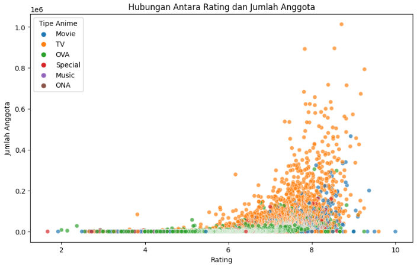

# Anime Recommendation System - Muhammad Rizki Putra

## Domain Project

#### Judul
Pengembangan Sistem Rekomendasi Anime Menggunakan Metode Collaborative Filtering dan Content Filtering

#### Latar Belakang
Industri anime global telah mengalami lonjakan popularitas dan volume produksi yang signifikan, dengan ribuan judul baru dirilis setiap tahunnya dan dapat diakses melalui berbagai platform digital di seluruh dunia. Menurut laporan industri (misalnya, dari Statista atau Research and Markets), pasar anime global terus menunjukkan tren pertumbuhan yang positif, mencerminkan peningkatan minat dan jangkauan konsumen secara luas. Ketersediaan konten yang melimpah ini, meskipun memberikan banyak pilihan, seringkali menimbulkan fenomena *information overload*, di mana pengguna menghadapi kesulitan untuk menemukan dan memilih anime yang sesuai dengan preferensi serta selera individual mereka di tengah katalog yang begitu besar dan beragam.

Seiring dengan kemajuan teknologi komputasi dan ilmu data, sistem rekomendasi berbasis *machine learning* telah menjadi pendekatan yang sangat efektif untuk mengatasi tantangan ini dalam berbagai domain, termasuk industri hiburan seperti anime. Sistem ini dirancang untuk menganalisis pola dari data interaksi pengguna dengan konten (pendekatan *Collaborative Filtering*), serta karakteristik intrinsik dari konten itu sendiri (pendekatan *Content Filtering*), guna menyajikan saran atau rekomendasi yang dipersonalisasi. Dengan demikian, sistem rekomendasi bertujuan membantu pengguna menavigasi pilihan yang luas secara lebih efisien dan menemukan konten yang paling relevan bagi mereka. Penggabungan kedua metode ini dapat memberikan rekomendasi yang lebih kaya dan mengatasi beberapa keterbatasan masing-masing metode, seperti masalah *cold start* pada *Collaborative Filtering* yang dapat dibantu oleh analisis fitur dari *Content Filtering*.

#### Mengapa Penting?
Penerapan metode *collaborative filtering* dan *content filtering* dalam sistem rekomendasi anime menawarkan potensi signifikan untuk meningkatkan pengalaman pengguna dan efektivitas platform penyedia konten. Model prediktif yang dibangun dapat membantu:

-   Meningkatkan kepuasan pengguna dengan menyajikan rekomendasi anime yang lebih akurat dan sesuai dengan selera individual. *Collaborative filtering* melakukannya berdasarkan histori tontonan dan penilaian pengguna lain dengan preferensi serupa, sementara *content filtering* merekomendasikan berdasarkan kemiripan fitur anime (seperti genre, tema, atau studio) dengan yang telah disukai pengguna.
-   Memfasilitasi penemuan konten baru (*content discovery*) yang mungkin terlewatkan oleh pengguna. *Collaborative filtering* dapat mengungkap item populer di antara pengguna serupa, sedangkan *content filtering* dapat menyarankan anime niche yang sesuai dengan preferensi fitur spesifik pengguna.
-   Meningkatkan *engagement* pengguna pada platform, seperti durasi menonton yang lebih lama dan frekuensi kunjungan yang lebih tinggi, karena pengguna lebih mudah menemukan konten yang menarik melalui beragam pendekatan rekomendasi.
-   Memberikan *insight* kepada penyedia konten mengenai tren preferensi pengguna, baik dari sisi pola rating kolektif maupun dari sisi fitur konten yang populer, yang dapat digunakan untuk strategi akuisisi atau promosi konten.

Studi dalam bidang sistem rekomendasi, seperti yang dilakukan oleh Su & Khoshgoftaar (2009) mengenai *collaborative filtering*, menunjukkan efektivitas metode ini dalam menghasilkan rekomendasi yang relevan dengan menganalisis pola perilaku kolektif pengguna. Dalam konteks anime, di mana selera bisa sangat beragam dan spesifik, pendekatan *collaborative filtering* memungkinkan sistem untuk menangkap nuansa preferensi yang mungkin sulit dijelaskan secara eksplisit. Di sisi lain, *content filtering* memberikan kekuatan dalam merekomendasikan item baru yang belum banyak mendapatkan interaksi, selama fiturnya dapat dianalisis, serta memberikan justifikasi yang lebih transparan atas rekomendasi yang diberikan.

#### Referensi :
-   Kaggle. Anime Recommendation Database (2020). Diakses dari: [Contoh: https://www.kaggle.com/datasets/hernan4444/anime-recommendation-database-2020] (Catatan: Ganti dengan link dataset yang relevan jika ada)
-   Su, X., & Khoshgoftaar, T. M. (2009). A Survey of Collaborative Filtering Techniques. *Advances in Artificial Intelligence*, 2009, 1-19. https://doi.org/10.1155/2009/421425

untuk penerapan kode lebih lengkap dapat dilihat di `notebook8b6cc425da.ipynb` dan `notebook8b6cc425da.py`

## Business Understanding

### Problem Statements
- Industri anime memiliki katalog konten yang sangat luas dan terus berkembang pesat, menyebabkan pengguna seringkali mengalami *information overload* dan kesulitan menemukan judul anime yang sesuai dengan selera serta preferensi unik mereka.
- Proses pencarian manual yang tidak efisien dapat mengurangi kepuasan pengguna, menyebabkan mereka melewatkan konten yang relevan, dan berpotensi menurunkan tingkat *engagement* pada platform penyedia layanan anime.

### Goals
- Membangun sebuah sistem rekomendasi anime yang mampu memberikan saran judul anime secara personal dan relevan kepada pengguna.
- Mengimplementasikan dan mengevaluasi dua pendekatan utama dalam sistem rekomendasi:
    1.  **Content-Based Filtering**, yang merekomendasikan anime berdasarkan kemiripan fitur antar anime.
    2.  **Collaborative Filtering**, yang merekomendasikan anime berdasarkan pola preferensi dari banyak pengguna.
- Mengevaluasi dan membandingkan kinerja algoritma spesifik dalam pendekatan Collaborative Filtering (misalnya, Singular Value Decomposition (SVD) dan K-Nearest Neighbors (KNN)).
- Menentukan pendekatan atau model rekomendasi yang paling efektif berdasarkan metrik evaluasi yang sesuai, seperti RMSE/MAE untuk prediksi rating dan/atau Precision@k/Recall@k untuk kualitas daftar rekomendasi top-N.
- Menyediakan dasar untuk pengembangan sistem yang dapat meningkatkan pengalaman pengguna dalam menemukan dan menikmati konten anime.

### Solution statements
Untuk mencapai tujuan-tujuan yang telah ditetapkan, proyek ini akan mengimplementasikan langkah-langkah strategis berikut, dengan fokus pada dua pendekatan utama sistem rekomendasi:

1.  **Pengembangan Pendekatan Rekomendasi Berbasis Konten (Content-Based Filtering):**
    Akan dikembangkan sebuah sistem rekomendasi yang menganalisis atribut atau fitur intrinsik dari setiap anime. Proses ini akan dimulai dengan pengumpulan dan persiapan data fitur anime (seperti `genre`, `type`, `studio`, `rating` komunitas, `jumlah episode` dari dataset `anime.csv`). Data tersebut akan melalui tahap pra-pemrosesan yang meliputi pembersihan data, parsing fitur (misalnya, memisahkan genre majemuk), dan transformasi fitur (misalnya, encoding genre dan tipe menjadi representasi numerik seperti TF-IDF atau One-Hot Encoding) untuk membangun profil item yang komprehensif. Selanjutnya, akan diimplementasikan algoritma untuk menghitung kemiripan antar profil item, yang akan digunakan untuk merekomendasikan anime yang serupa dengan yang pernah disukai atau dipilih pengguna.

2.  **Pengembangan Pendekatan Rekomendasi Berbasis Kolaborasi (Collaborative Filtering):**
    Akan dikembangkan sebuah sistem rekomendasi yang memanfaatkan data historis interaksi antara pengguna dan anime, khususnya data rating dari dataset `rating.csv`. Pendekatan ini tidak bergantung pada fitur eksplisit dari item, melainkan pada pola perilaku kolektif pengguna. Algoritma seperti Singular Value Decomposition (SVD) dan K-Nearest Neighbors (KNN) akan diimplementasikan untuk memodelkan preferensi pengguna dan item. Proses ini akan melibatkan tahap pra-pemrosesan data rating (penanganan nilai hilang atau tidak valid), pelatihan model, dan optimasi parameter (hyperparameter tuning) untuk masing-masing algoritma guna mencapai kinerja prediktif terbaik.

3.  **Implementasi dan Pelatihan Model dari Kedua Pendekatan:**
    Model-model dari kedua pendekatan, Content-Based Filtering dan Collaborative Filtering (termasuk variasi algoritma seperti SVD dan KNN), akan diimplementasikan secara terpisah. Setiap model akan dilatih menggunakan dataset yang telah dipersiapkan sesuai dengan kebutuhan masing-masing pendekatan. Untuk Collaborative Filtering, dataset akan dibagi menjadi data latih dan data uji untuk memungkinkan evaluasi yang objektif.

4.  **Evaluasi Kinerja Model Rekomendasi Secara Komprehensif:**
    Kinerja dari setiap model yang telah dilatih, baik dari pendekatan Content-Based maupun Collaborative Filtering, akan diukur dan dibandingkan secara kuantitatif. Untuk model Collaborative Filtering yang memprediksi rating (seperti SVD dan KNN), metrik evaluasi seperti Root Mean Squared Error (RMSE) dan Mean Absolute Error (MAE) akan digunakan. Untuk kualitas daftar rekomendasi top-N yang dihasilkan (jika dieksplorasi lebih lanjut), metrik seperti Precision@k, Recall@k, dan F1-Score@k dapat dipertimbangkan. Analisis komparatif akan dilakukan untuk memahami kekuatan dan kelemahan masing-masing model dan pendekatan.

5.  **Analisis Hasil dan Pemilihan Strategi Rekomendasi Optimal:**
    Berdasarkan hasil evaluasi kinerja, akan dilakukan analisis mendalam untuk menentukan model atau pendekatan mana yang paling efektif dan sesuai untuk memberikan rekomendasi anime dalam konteks dataset yang digunakan. Selain metrik kuantitatif, aspek kualitatif seperti kemampuan model menangani masalah *cold start* (untuk pengguna baru atau item baru) dan keragaman rekomendasi juga dapat didiskusikan. Hasil analisis ini akan menjadi dasar untuk menyimpulkan strategi rekomendasi yang optimal untuk proyek ini.

## Data Understanding

Sumber dataset: [Anime Recommendations Database - Kaggle](https://www.kaggle.com/datasets/CooperUnion/anime-recommendations-database/data)

Dataset yang digunakan dalam proyek ini adalah **Anime Recommendations Database**, yang dapat diunduh secara publik melalui platform Kaggle. Dataset ini bertujuan untuk menyediakan data yang dapat digunakan untuk membangun sistem rekomendasi anime, membantu pengguna menemukan tontonan baru berdasarkan preferensi dan perilaku pengguna lain, serta karakteristik anime itu sendiri.

Dataset ini terdiri dari dua file CSV utama, yaitu `anime.csv` dan `rating.csv`.

### Informasi Variabel Pada Dataset

#### `anime.csv`

| Fitur        | Tipe Data             | Deskripsi                                                                                         |
|--------------|------------------------|---------------------------------------------------------------------------------------------------|
| anime_id     | Numerik (Integer)      | ID unik untuk setiap anime. Merupakan kunci utama dataset.                                        |
| name         | Kategorikal (String)   | Judul lengkap dari anime.                                                                         |
| genre        | Kategorikal (String)   | Daftar genre anime, dipisahkan koma. Beberapa nilai hilang.                                      |
| type         | Kategorikal (String)   | Jenis format anime, seperti "TV", "Movie", "OVA", "Special". Beberapa nilai hilang.              |
| episodes     | String (perlu konversi)| Jumlah episode. Berisi nilai non-numerik seperti "Unknown", perlu dibersihkan dan dikonversi.    |
| rating       | Numerik (Float)        | Rata-rata rating komunitas, skala 1–10. Beberapa nilai hilang.                                   |
| members      | Numerik (Integer)      | Jumlah anggota komunitas yang memiliki anime ini di daftar mereka. Sebagai proxy popularitas.    |

#### `rating.csv`

| Fitur     | Tipe Data           | Deskripsi                                                                                   |
|-----------|----------------------|---------------------------------------------------------------------------------------------|
| user_id   | Numerik (Integer)    | ID unik untuk setiap pengguna.                                                              |
| anime_id  | Numerik (Integer)    | ID anime yang diberi rating. Foreign key yang terhubung ke `anime.csv`.                    |
| rating    | Numerik (Integer)    | Rating dari pengguna terhadap anime. Skala 1–10. Nilai `-1` kemungkinan berarti belum diberi rating. |

## Visualization & Explanatory Analysis

Tahap visualisasi data dilakukan untuk menyajikan hasil analisis dalam bentuk grafik dan diagram yang lebih mudah dipahami. Teknik visualisasi seperti histogram, scatter plot, heatmap, dan box plot digunakan untuk melihat distribusi data, hubungan antar variabel, serta pola yang mungkin muncul dalam dataset.

Selain itu, dilakukan explanatory analysis untuk menjelaskan temuan dari proses eksplorasi dan pemodelan. Interpretasi visualisasi membantu dalam mengidentifikasi tren signifikan, anomali, serta wawasan penting yang dapat digunakan untuk pengambilan keputusan.

Dengan pendekatan ini, hasil analisis menjadi lebih informatif dan dapat disajikan dengan cara yang jelas serta mudah dipahami.

### Exploratory Data Analysis (EDA)
Selanjutnya pada tahap ini dilakukan EDA untuk memahami karakteristik data sebelum proses pemodelan. Analisis ini mencakup pemeriksaan distribusi data, deteksi nilai kosong, identifikasi anomali. Tahap-tahap untuk EDA kali ini adalah :

1. Cek data secara umum apakah ada anomali atau tidak.
    
    Untuk cek apakah terdapat anomali atau tidak maka bisa menjalani :

    `anime_df.info()`

    |   | Column    | Non-Null Count | Dtype   |
    |---|-----------|----------------|---------|
    | 0 | anime_id  | 12294 non-null | int64   |
    | 1 | name      | 12294 non-null | object  |
    | 2 | genre     | 12232 non-null | object  |
    | 3 | type      | 12269 non-null | object  |
    | 4 | episodes  | 12294 non-null | object  |
    | 5 | rating    | 12064 non-null | float64 |
    | 6 | members   | 12294 non-null | int64   |

    dengan :

    * Class: pandas.core.frame.DataFrame
    * RangeIndex: 12294 entri, dari 0 hingga 12293
    * Data columns: Total 7 kolom

    `rating_df.info()`

    |   | Column    | Non-Null Count | Dtype |
    |---|-----------|----------------|-------|
    | 0 | user_id   | 7813737 non-null | int64 |
    | 1 | anime_id  | 7813737 non-null | int64 |
    | 2 | rating    | 7813737 non-null | int64 |

    dengan :

    * Class: pandas.core.frame.DataFrame
    * RangeIndex: 7813737 entri, dari 0 hingga 7813736
    * Data columns: Total 3 kolom

  Dari data tersebut ditemukan kalau `episode` masih dalam berbentuk object, hal ini akan diperbaiki ketika memasuki tahap `data cleaning`.

2. Cek apakah data terdapat yang kosong.

    Untuk mengecek apakah terdapat data kosong atau tidak kita bisa menjalankan kode berikut :

    `anime_df.isna().sum()`

    Output : 
    |   | Kolom     | Jumlah Missing Values |
    |---|-----------|------------------------|
    | 0 | anime_id  | 0                      |
    | 1 | name      | 0                      |
    | 2 | genre     | 62                     |
    | 3 | type      | 25                     |
    | 4 | episodes  | 0                      |
    | 5 | rating    | 230                    |
    | 6 | members   | 0                      |

    `rating_df.isna().sum()`
    
    Output : 
    |   | Kolom     | Jumlah Missing Values |
    |---|-----------|------------------------|
    | 0 | user_id   | 0                      |
    | 1 | anime_id  | 0                      |
    | 2 | rating    | 0                      |

    Dari hasil tersebut dapat dilihat kalau pada `anime_df` terdapat beberapa data yang kosong, sedangkan untuk `rating_df` tidak ada data kosong.

3. Cek apakah data ada yang duplikat.

    Selanjutnya untuk mengecek apakah terdapat data yang duplikat dapat menjalani kode berikut :

    `anime_df.duplicated().sum()`

    Output :

    `0`

    `rating_df.duplicated().sum()`

    Output :

    `1`

    Ditemukan 1 data duplikat pada `rating_df`.

4. Cek data secara statistik seperti mean, modus, median, dan standar deviasi.

    Untuk mengecek statistik data dapat menjalani kode berikut :

    `anime_df.describe()`

    |       Statistik       | anime_id     | rating     | members     |
    |-----------------------|--------------|------------|-------------|
    | count                 | 12294.0      | 12064.0    | 1.229400e+04     |
    | mean                  | 14058.22     | 6.47       | 1.807134e+04    |
    | std (standard deviasi)| 11455.29     | 1.03       | 5.482068e+04    |
    | min                   | 1.0          | 1.67       | 5.000000e+00   |
    | 25% (kuartil 1)       | 3484.25      | 5.88       | 2.250000e+02       |
    | 50% (median)          | 10260.5      | 6.57       | 1.550000e+03     |
    | 75% (kuartil 3)       | 24794.5      | 7.18       | 9.437000e+03   |
    | max                   | 34527.0      | 10.0       | 1.013917e+06  |

    `rating_df.describe()`

    |       Statistik       | user_id      | anime_id     | rating      |
    |-----------------------|--------------|--------------|-------------|
    | count                 | 7,813,737.0  | 7,813,737.0  | 7,813,737.0 |
    | mean                  | 36,727.96    | 8,909.07     | 6.14        |
    | std (standard deviasi)| 20,997.95    | 8,883.95     | 3.73        |
    | min                   | 1.0          | 1.0          | -1.0        |
    | 25% (kuartil 1)       | 18,974.0     | 1,240.0      | 6.0         |
    | 50% (median)          | 36,791.0     | 6,213.0      | 7.0         |
    | 75% (kuartil 3)       | 54,757.0     | 14,093.0     | 9.0         |
    | max                   | 73,516.0     | 34,519.0     | 10.0        |

    Penjelasan : 
    - Count adalah jumlah sampel pada data.
    - Mean adalah nilai rata-rata.
    - Std adalah standar deviasi.
    - Min yaitu nilai minimum.
    - 25% adalah kuartil pertama.
    - 50% adalah kuartil kedua.
    - 75% adalah kuartil ketiga.
    - Max adalah nilai maksimum.

    Dari data tersebut terdapat keanehan pada `rating` dalam `rating_df` sebab terdapat nilai `-1` yang seharunya rating hanya dijangkauan  1 - 10. Hal ini akan diperbaiki ketika memasuki `Data Transformasi`.

#### Hasil EDA : 

Dari EDA, ditemukan beberapa data kotor antara lain :
- Dari `anime_df` kolom `genre` terdapat 62 baris kosong, dan `rating` terdapat 230 baris kosong.
- Pada `rating_df` terdapat 1 baris yang duplikat.
- `episodes` Pada `anime_df` masih dalam bentuk `object` yang seharusnya dalam bentuk `int`.

---

### Data Visualization
Visualisasi data dilakukan untuk memahami pola dan hubungan antar variabel dalam dataset. Dengan menggunakan grafik seperti histogram, scatter plot, dan heatmap, data dapat ditampilkan dengan lebih intuitif sehingga memudahkan analisis. Teknik visualisasi yang tepat dapat membantu dalam mengidentifikasi tren, distribusi, serta anomali yang mungkin terjadi dalam data.

Visualisasi data yang akan di eksplorasi antara lain :

#### 1. Distribusi Tipe Anime : 

#### 2. Distribusi Rating Anime

#### 3. Hubungan Antara Rating dan Jumlah Anggota 

#### 4. Distribusi Top 10 Anime Dengan Rating Tertinggi

#### 5. Distribusi Top 10 Anime Dengan Rating Terbanyak

#### 6. Korelasi Matriks Fitur Numerik `rating_df`

Hasil yang didapati dari tahap ini adalah :

**Insight**

---

1. Dataset Overview
Dua dataset utama digunakan dalam proyek ini: `anime.csv` dan `rating.csv`.

* **`anime_df` (dari `anime.csv`)**:
    * **Jumlah data awal:** 12.294 entri anime.
    * **Jumlah fitur:** 7 kolom awal (`anime_id`, `name`, `genre`, `type`, `episodes`, `rating`, `members`). Fitur `genre_list` ditambahkan selama persiapan data.
    * **Tipe Fitur**:
        * **Numerik**: `anime_id` (setelah pembersihan, `episodes` juga menjadi numerik/float), `rating`, `members`.
        * **Kategorikal/Object**: `name`, `genre`, `type`.
* **`rating_df` (dari `rating.csv`)**:
    * **Jumlah data awal:** 7.813.737 entri rating.
    * **Jumlah fitur:** 3 kolom (`user_id`, `anime_id`, `rating`).
    * **Tipe Fitur**: Semuanya numerik (`int64`).

---

2. Ringkasan Exploratory Data Analysis (EDA)

* **Kualitas Data Awal `anime_df`**:
    * **Nilai Hilang**: Ditemukan pada kolom `genre` (62 nilai), `type` (25 nilai), dan `rating` (230 nilai).
    * **Tipe Data**: Kolom `episodes` awalnya bertipe `object` dan mengandung nilai non-numerik seperti "Unknown".
    * **Duplikat**: Tidak ada data duplikat pada `anime_df`.
* **Kualitas Data Awal `rating_df`**:
    * **Nilai Hilang**: Tidak ada nilai hilang pada kolom utama.
    * **Duplikat**: Terdapat 1 baris data duplikat.
    * **Nilai Rating Khusus**: Kolom `rating` memiliki nilai `-1` yang mengindikasikan anime telah ditonton tetapi tidak diberi rating oleh pengguna.

Hasil EDA akan ditindaklanjutkan pada bagian `data preparation`

---

3. Statistik Deskriptif Fitur Numerik Utama

`anime_df`
| Statistik | anime_id   | rating    | members       |
|-----------|------------|-----------|---------------|
| count     | 12294      | 12064     | 12294         |
| mean      | 14058.22   | 6.47      | 18071.34      |
| std       | 11455.29   | 1.03      | 54820.68      |
| min       | 1          | 1.67      | 5             |
| 25%       | 3484.25    | 5.88      | 225           |
| 50%       | 10260.50   | 6.57      | 1550          |
| 75%       | 24794.50   | 7.18      | 9437          |
| max       | 34527      | 10.00     | 1013917       |

`rating_df`
| Statistik | user_id    | anime_id  | rating   |
|-----------|------------|-----------|----------|
| count     | 7813737    | 7813737   | 7813737  |
| mean      | 36727.96   | 8909.07   | 6.14     |
| std       | 20997.95   | 8883.95   | 3.73     |
| min       | 1          | 1         | -1.00    |
| 25%       | 18974      | 1240      | 6.00     |
| 50%       | 36791      | 6213      | 7.00     |
| 75%       | 54757      | 14093     | 9.00     |
| max       | 73516      | 34519     | 10.00    |

---

4. Insight Tambahan Berdasarkan Visualisasi

* **Distribusi Tipe Anime (`anime_df`)**:
    * Tipe anime yang paling umum adalah **`TV`**, diikuti oleh `Movie`, `OVA`, `Special`, `ONA`, dan `Music`.
* **Distribusi Rating Anime (`anime_df`)**:
    * Distribusi rating anime (dari komunitas) cenderung normal dengan puncak di sekitar skor 6 hingga 8.
* **Hubungan Rating dan Jumlah Anggota (`anime_df`)**:
    * Terdapat tren umum bahwa anime dengan **rating lebih tinggi cenderung memiliki jumlah anggota (popularitas) yang lebih tinggi** juga.
    * Anime tipe `TV` tersebar luas di berbagai tingkat rating dan jumlah anggota.
* **Heatmap Korelasi Fitur (`rating_df`)**:
    * Korelasi positif lemah (0.29) antara `anime_id` dan `rating` pengguna.
    * Korelasi lainnya sangat lemah.
* **Top 10 Anime dengan Jumlah Rating Terbanyak dan terpopuler (`rating_df_cleaned` & `anime_df`)**:
    * Anime seperti "Death Note", "Code Geass", "Shingeki no Kyojin", dan "Sword Art Online" memiliki jumlah rating paling banyak dari pengguna, menunjukkan popularitas interaksi yang tinggi di dataset ini.

---

5. Rencana/Langkah Persiapan Data (yang telah dilakukan sebelum pemodelan)
Langkah-langkah persiapan data yang telah dilakukan untuk menyiapkan data sebelum proses pemodelan meliputi:

* **Pembersihan Data** : Melakukan pembersihan data hasil dari EDA.
* **Parsing Fitur `genre` (`anime_df`)**: Kolom `genre` yang berisi string genre dipisahkan koma telah di-parse menjadi list genre individual dan disimpan dalam kolom baru `genre_list`.
* **Encoding Fitur Kategorikal**:
    * **`genre_list` (`anime_df`)**: Dilakukan encoding menggunakan `MultiLabelBinarizer` untuk mengubah list genre menjadi representasi numerik biner (one-hot encoding untuk multi-label).
    * **`type` (`anime_df`)**: Dilakukan one-hot encoding menggunakan `pd.get_dummies` untuk mengubah fitur tipe anime menjadi representasi numerik.
* **Persiapan Data untuk Pustaka Surprise**:
    * `rating_df_cleaned` (setelah penghapusan rating -1) digunakan.
    * Objek `Reader` dari pustaka Surprise dikonfigurasi untuk skala rating 1-10.
    * Dataset dimuat ke dalam format `Dataset` Surprise menggunakan `load_from_df`.
    * Dataset kemudian dibagi menjadi `trainset` dan `testset` (80:20) untuk melatih dan mengevaluasi model Collaborative Filtering.

## Data Preparation
---

Data Preparation adalah tahap penting sebelum kita dapat membuat model *sistem rekomendasi*, dalam kasus ini, sebuah sistem rekomendasi anime. Tujuan dari langkah ini adalah untuk memastikan data yang kita gunakan berkualitas baik, bersih dari hal-hal yang bisa mengganggu analisis, dan siap untuk "dipelajari" oleh komputer. Kualitas data yang baik di tahap ini sangat menentukan seberapa akurat dan andal sistem rekomendasi yang akan kita bangun.

Dalam proyek sistem rekomendasi anime ini, proses persiapan data melibatkan langkah-langkah berikut, yang disesuaikan untuk mencerminkan urutan pemrosesan yang logis dan praktik umum dalam *notebook* analisis data:

### 1. Pembersihan dan Pra-pemrosesan Data Awal
Tahap ini berfokus pada penanganan masalah kualitas data dasar pada kedua dataset utama: `anime_df` (informasi detail anime) dan `rating_df` (data rating dari pengguna).

* **Dataset Informasi Anime (`anime_df`):**
    * **Masalah Awal:**
        * Kolom `episodes` memiliki tipe data `object` dan mengandung nilai non-numerik (misalnya, 'Unknown'), padahal seharusnya merepresentasikan jumlah episode sebagai angka.
        * Kolom `genre` memiliki 62 baris dengan nilai kosong.
        * Kolom `rating` (rating rata-rata anime dari komunitas) memiliki 230 baris dengan nilai kosong.
    * **Tindakan dan Alasan:**
        1.  **Konversi Tipe Data `episodes`**: Kolom `episodes` dikonversi menjadi tipe data numerik menggunakan `pd.to_numeric` dengan `errors='coerce'`. Opsi `coerce` akan mengubah nilai apa pun yang tidak dapat dikonversi menjadi angka (seperti 'Unknown') menjadi `NaN` (Not a Number). Ini penting agar kolom `episodes` dapat digunakan dalam analisis numerik.
        2.  **Penanganan Nilai Kosong (`NaN`) Komprehensif**: Setelah konversi `episodes` (yang mungkin menghasilkan `NaN` baru), seluruh baris yang mengandung *setidaknya satu nilai `NaN`* pada `anime_df` (termasuk pada kolom `episodes`, `genre`, dan `rating` yang sudah kosong dari awal) dihapus menggunakan metode `dropna()`. Langkah ini memastikan bahwa `anime_df` yang digunakan untuk pemodelan hanya berisi data yang lengkap dan konsisten, karena fitur-fitur ini krusial untuk kedua jenis sistem rekomendasi.

* **Dataset Rating Pengguna (`rating_df`):**
    * **Masalah Awal:**
        * Terdapat 1 baris data yang merupakan duplikat sempurna.
        * Kolom `rating` (skor yang diberikan pengguna) mengandung nilai `-1`.
    * **Tindakan dan Alasan:**
        1.  **Penghapusan Data Duplikat**: Baris duplikat dihapus dari `rating_df` menggunakan `drop_duplicates()`. Duplikasi dapat menyebabkan bias dalam analisis karena satu interaksi pengguna terhadap anime akan dihitung lebih dari sekali.
        2.  **Penanganan Nilai Rating `-1`**: Nilai `-1` pada kolom `rating` memiliki arti khusus, yaitu pengguna telah menonton anime tersebut tetapi tidak memberikan skor (1-10). Untuk model *Collaborative Filtering* yang akan dibangun, kita memerlukan preferensi eksplisit. Oleh karena itu, semua baris dengan `rating = -1` dihapus. Hasil dari pembersihan ini disimpan sebagai `rating_df_cleaned`. Ini memastikan model belajar dari data yang jelas menunjukkan tingkat kesukaan pengguna.

### 2. Transformasi Fitur untuk *Content-Based Filtering*
Langkah ini bertujuan menyiapkan fitur-fitur dari `anime_df` yang telah dibersihkan agar dapat digunakan oleh model berbasis konten.

* **Mengurai Fitur Genre Anime (`genre`)**:
    * **Proses**: Informasi genre pada `anime_df` awalnya berupa string tunggal yang berisi beberapa genre dipisahkan koma (misalnya, "Action, Adventure, Drama"). String ini diurai sehingga setiap genre individual menjadi elemen dalam sebuah daftar (list). Hasilnya disimpan dalam kolom baru bernama `genre_list`.
    * **Alasan**: Memisahkan genre memudahkan proses *encoding* dan memungkinkan analisis yang lebih detail terhadap kontribusi masing-masing genre terhadap kesamaan antar anime.

* **Encoding Fitur Kategori menjadi Format Numerik**:
    Model *machine learning* umumnya bekerja dengan angka. Oleh karena itu, fitur kategorikal perlu diubah.
    1.  **Encoding Fitur `genre_list`**:
        * **Metode**: `MultiLabelBinarizer` dari `sklearn.preprocessing`.
        * **Proses**: Setiap genre unik dalam `genre_list` diubah menjadi format biner (0 atau 1) dalam bentuk matriks (`genre_encoded`). Setiap kolom mewakili satu genre; nilai 1 menandakan anime tersebut memiliki genre tersebut, dan 0 jika tidak. Ini cocok karena satu anime bisa memiliki banyak genre.
    2.  **Encoding Fitur `type` (Tipe Anime)**:
        * **Metode**: *One-Hot Encoding* menggunakan `pd.get_dummies` dari Pandas.
        * **Proses**: Fitur `type` (misalnya, "TV", "Movie", "OVA") diubah menjadi representasi numerik (`type_encoded`). Setiap nilai unik pada fitur `type` menjadi kolom baru, dan anime akan mendapat nilai 1 pada kolom yang sesuai dengan tipenya dan 0 pada lainnya.

* **Standardisasi Fitur Numerik**:
    * **Fitur Terlibat**: `episodes`, `rating` (dari `anime_df`), dan `members`. Fitur-fitur ini memiliki rentang nilai yang sangat berbeda (misalnya, episode bisa ribuan, rating 1-10).
    * **Proses**: Dilakukan standardisasi menggunakan `StandardScaler` dari `sklearn.preprocessing`. Proses ini mengubah nilai setiap fitur sehingga memiliki rata-rata 0 dan standar deviasi 1.
    * **Alasan**: Standardisasi memastikan bahwa fitur dengan skala nilai yang lebih besar (seperti `members` atau `episodes`) tidak mendominasi perhitungan kesamaan dibandingkan fitur dengan skala nilai lebih kecil (seperti `rating`). Ini membuat perbandingan antar fitur lebih adil. Hasilnya disimpan sebagai `numerical_features_scaled_df`.

* **Penggabungan Fitur (Feature Concatenation)**:
    * **Proses**: Matriks fitur yang telah di-encode (`genre_encoded`, `type_encoded`) dan fitur numerik yang telah distandarisasi (`numerical_features_scaled_df`) kemudian digabungkan secara horizontal (kolom per kolom) menjadi satu matriks fitur tunggal menggunakan `pd.concat(..., axis=1)`. Matriks komprehensif ini (`content_all_features`) merepresentasikan setiap anime berdasarkan seluruh fitur konten yang relevan.
    * **Alasan**: Matriks gabungan inilah yang akan digunakan untuk menghitung *cosine similarity* antar anime dalam pendekatan *Content-Based Filtering*.

### 3. Persiapan Data untuk *Collaborative Filtering* (Menggunakan Pustaka Surprise)
Untuk model rekomendasi *Collaborative Filtering*, yang menganalisis pola rating antar pengguna, digunakan pustaka `surprise`.

1.  **Konfigurasi Skala Rating**:
    * Sebuah objek `Reader` dari pustaka `surprise` disiapkan, dengan parameter `rating_scale=(1, 10)` untuk memberitahu sistem bahwa skala rating yang valid adalah dari 1 hingga 10.

2.  **Memuat Data ke Format `Dataset` `surprise`**:
    * Data rating yang sudah bersih (`rating_df_cleaned`), yang kini hanya berisi kolom `user_id`, `anime_id`, dan `rating` (skor valid), dimuat ke dalam format `Dataset` khusus yang disediakan oleh pustaka `surprise`. Ini dilakukan menggunakan fungsi `Dataset.load_from_df()`.

3.  **Pembagian Data Latih dan Data Uji**:
    * **Proses**: Dataset yang sudah dalam format `surprise` dibagi menjadi dua bagian: 80% sebagai data latih (`trainset`) dan 20% sebagai data uji (`testset`) menggunakan fungsi `train_test_split` dari `surprise.model_selection`.
    * **Alasan**:
        * **Data Latih**: Digunakan untuk "melatih" model rekomendasi, yaitu mengajarkan model untuk mengenali pola-pola rating dari pengguna.
        * **Data Uji**: Digunakan untuk menguji seberapa baik performa model yang telah dilatih pada data yang belum pernah "dilihat" sebelumnya. Ini memberikan evaluasi objektif terhadap akurasi model.

Dengan menyelesaikan semua langkah persiapan data ini, kita memiliki dataset yang siap dan optimal untuk digunakan dalam melatih dan mengevaluasi berbagai model sistem rekomendasi anime.

## Modeling and Result

Setelah data anime dan rating pengguna dipersiapkan dengan baik, tahap selanjutnya adalah *Modeling*. Pada tahap ini, kita membangun dan melatih berbagai "mesin" atau algoritma *machine learning* yang akan menghasilkan rekomendasi anime. Tujuan utamanya adalah menciptakan sistem yang dapat memberikan saran anime yang paling relevan dan menarik bagi setiap pengguna, berdasarkan preferensi yang telah dipelajari dari data.

Dalam proyek sistem rekomendasi anime ini, kami menggunakan dua pendekatan utama, yaitu *Content-Based Filtering* dan *Collaborative Filtering*, dengan beberapa algoritma spesifik di bawahnya:

### 1. Content-Based Filtering: Rekomendasi Berdasarkan Kemiripan Konten Anime

Pendekatan ini merekomendasikan anime berdasarkan kemiripan karakteristik atau fitur kontennya. Jika seorang pengguna menyukai sebuah anime, sistem akan mencari anime lain yang memiliki ciri serupa — misalnya dari segi genre, jumlah episode, rating, hingga jumlah anggota yang memberi penilaian.

Untuk merepresentasikan anime secara numerik, beberapa fitur seperti `genre` dan `type` telah di-*encode*, sementara fitur numerik seperti `episodes`, `rating`, dan `members` perlu disesuaikan skalanya agar adil dalam perhitungan kemiripan. Fitur numerik tersebut dapat memiliki skala yang sangat berbeda (misalnya, `members` bisa mencapai ratusan ribu sementara `rating` hanya dalam rentang 1–10). 

Untuk mengatasi hal ini, digunakan `StandardScaler` dari pustaka `sklearn.preprocessing` untuk melakukan **standarisasi**. Proses ini mengubah setiap fitur numerik agar memiliki **rata-rata 0** dan **standar deviasi 1**, sehingga tidak ada satu fitur pun yang mendominasi dalam perhitungan.

---

#### a. Cosine Similarity (Kemiripan Kosinus)

**Penjelasan Singkat**:
Cosine Similarity adalah metode yang digunakan untuk mengukur tingkat kemiripan antara dua item berdasarkan arah vektor fitur mereka, bukan besar nilainya. Dalam konteks ini, setiap anime direpresentasikan sebagai sebuah vektor dalam ruang multi-dimensi. Cosine Similarity mengukur sudut antar vektor ini — semakin kecil sudutnya (semakin dekat arahnya), semakin besar kemiripan antar anime.

**Proses Utama**:
1. **Representasi Fitur**  
   Setiap anime direpresentasikan sebagai vektor numerik berdasarkan fitur-fitur yang telah diproses.
2. **Perhitungan Kemiripan**  
   Fungsi `cosine_similarity` dari `sklearn.metrics.pairwise` digunakan untuk menghitung skor kemiripan antar semua pasangan anime.
3. **Pemberian Rekomendasi**  
   Untuk setiap anime yang disukai pengguna, sistem mencari anime lain yang memiliki nilai cosine similarity tertinggi terhadap anime tersebut.

**Kelebihan**:
- Mampu memberikan rekomendasi yang relevan berdasarkan karakteristik item yang sudah diketahui.
- Tidak memerlukan interaksi dari banyak pengguna lain seperti pada collaborative filtering.
- Rekomendasi dapat dijelaskan secara logis (misalnya: “anime ini direkomendasikan karena mirip dari segi genre dan popularitas dengan anime yang Anda sukai”).

**Kekurangan**:
- Kualitas rekomendasi sangat bergantung pada fitur yang tersedia. Fitur yang terbatas atau tidak informatif akan membatasi kemampuan sistem.
- Rentan terhadap efek "filter bubble" — pengguna cenderung hanya mendapatkan rekomendasi yang mirip dengan apa yang sudah mereka sukai, tanpa adanya unsur eksplorasi.
- Cenderung menghasilkan rekomendasi yang aman atau kurang inovatif karena berbasis kemiripan langsung.

---

Dengan pendekatan ini, sistem dapat memberikan rekomendasi anime yang personal dan relevan, khususnya saat informasi preferensi pengguna masih terbatas.

### 2. Collaborative Filtering: Rekomendasi Berdasarkan Pola Kolektif Pengguna

Pendekatan ini bekerja dengan cara menemukan pola dari sejumlah besar data rating pengguna. Idenya adalah jika pengguna A memiliki pola rating yang mirip dengan pengguna B, maka anime yang disukai pengguna B (namun belum ditonton pengguna A) kemungkinan besar juga akan disukai oleh pengguna A.

   **a. Singular Value Decomposition (SVD)**

   * **Penjelasan Singkat**:
        SVD adalah teknik faktorisasi matriks yang populer dalam sistem rekomendasi. Ia bekerja dengan "mengurai" matriks besar yang berisi rating dari semua pengguna untuk semua anime menjadi beberapa matriks yang lebih kecil dan lebih sederhana. Matriks-matriks ini mencoba menangkap "faktor laten" atau karakteristik tersembunyi yang menjelaskan mengapa seorang pengguna memberikan rating tertentu pada sebuah anime.

   * **Parameter Kunci yang Digunakan (dari pustaka `surprise`)**:
        * `n_factors=100`: Menentukan jumlah faktor laten yang akan dicari oleh model. Ini adalah dimensi dari ruang laten tempat pengguna dan item diproyeksikan. Nilai ini dipilih melalui eksperimen untuk mendapatkan keseimbangan antara kompleksitas model dan performa.
        * `n_epochs=20`: Jumlah iterasi atau "putaran belajar" yang dilakukan model pada keseluruhan data latih. Semakin banyak epoch, model berpotensi belajar lebih baik, tetapi juga bisa berisiko *overfitting*.
        * `random_state=42`: Digunakan untuk memastikan bahwa hasil yang didapatkan konsisten setiap kali model dijalankan dengan data dan parameter yang sama, sehingga memudahkan analisis dan perbandingan.

   * **Kelebihan**:
        * Mampu menangkap pola yang kompleks dan halus dalam data rating, seringkali menghasilkan rekomendasi yang lebih akurat dibandingkan metode yang lebih sederhana.
        * Dapat membantu menemukan rekomendasi yang mengejutkan atau *serendipitous* karena model belajar fitur laten yang mungkin tidak secara eksplisit terlihat.
        * Efektif bahkan ketika matriks rating pengguna-anime sangat *sparse* (banyak entri yang kosong/belum ada rating).

   * **Kekurangan**:
        * Sulit untuk menjelaskan mengapa suatu item direkomendasikan karena faktor laten bersifat abstrak dan tidak mudah diinterpretasikan.
        * Mengalami masalah "cold start": sulit memberikan rekomendasi untuk pengguna baru (yang belum punya riwayat rating) atau untuk item baru (yang belum pernah diberi rating).
        * Proses pelatihan bisa memakan waktu dan sumber daya komputasi yang lebih besar dibandingkan beberapa algoritma lain, terutama pada dataset yang sangat besar.

   **b. k-Nearest Neighbors (KNN)**

   * **Penjelasan Singkat**:
        Metode KNN dalam Collaborative Filtering bekerja dengan mencari "tetangga" terdekat dari seorang pengguna atau sebuah item.
        * **User-based KNN**: Menemukan sekelompok pengguna (tetangga) yang memiliki pola rating paling mirip dengan pengguna target, lalu merekomendasikan anime yang disukai oleh para tetangga tersebut.
        * **Item-based KNN**: Menemukan sekelompok item (tetangga) yang paling mirip dengan item yang disukai oleh pengguna target (berdasarkan bagaimana item-item tersebut diberi rating oleh pengguna lain secara keseluruhan), lalu merekomendasikan item-item tetangga tersebut.

   * **Parameter Kunci yang Digunakan (dari pustaka `surprise`, contohnya `KNNWithMeans`)**:
        * `k=40`: Menentukan jumlah "tetangga" (pengguna atau item) terdekat yang akan dipertimbangkan saat membuat prediksi rating.
        * `sim_options = {'name': 'cosine', 'user_based': False}`:
            * `'name': 'cosine'`: Menentukan metrik kemiripan yang digunakan untuk mengukur seberapa mirip antar pengguna atau antar item. Dalam hal ini, digunakan kemiripan kosinus.
            * `'user_based': False`: Mengindikasikan bahwa kita menggunakan pendekatan *Item-based KNN* (mencari kemiripan antar item). Jika `True`, maka akan menjadi *User-based KNN*.
        * `min_k=1`: Jumlah minimal tetangga yang harus ada agar prediksi bisa dibuat.

   * **Kelebihan**:
        * Konsepnya relatif sederhana dan mudah dipahami.
        * Rekomendasi bisa cukup mudah dijelaskan (misalnya, "Pengguna lain yang menyukai anime X juga menyukai anime Y").
        * Dapat menghasilkan rekomendasi yang cukup beragam dan terkadang mengejutkan.
        * Cukup efektif untuk dataset yang tidak terlalu besar dan dapat diimplementasikan dengan relatif cepat.

   * **Kekurangan**:
        * Juga mengalami masalah "cold start" untuk pengguna dan item baru.
        * Performa bisa menurun pada dataset yang sangat *sparse* (jarang ada rating) karena sulit menemukan tetangga yang relevan.
        * Perhitungan kemiripan bisa menjadi mahal secara komputasi pada dataset dengan jumlah pengguna atau item yang sangat besar (masalah skalabilitas).
        * Sensitif terhadap pemilihan jumlah tetangga (`k`) dan metrik kemiripan.

Dengan melatih dan mengevaluasi model-model ini, kami dapat memilih atau menggabungkan pendekatan yang memberikan hasil rekomendasi anime terbaik bagi pengguna.

### 3. Pengujian Sistem Rekomendasi
---

Setelah tahap persiapan data dan pemodelan, tahap selanjutnya adalah pengujian sistem rekomendasi anime yang telah dikembangkan. Bagian ini bertujuan untuk mendemonstrasikan bagaimana sistem menghasilkan rekomendasi, menyajikan contoh output dari salah satu model yang diimplementasikan, dan membahas pendekatan yang digunakan. Pengujian ini penting untuk memvalidasi bahwa sistem dapat menjalankan fungsinya dalam memberikan saran anime kepada pengguna.

Sistem rekomendasi yang dibangun menggunakan dua pendekatan utama, yaitu *Collaborative Filtering* dan *Content-Based Filtering*, sebagaimana telah diuraikan pada bagian sebelumnya (Modeling). Dalam bagian pengujian ini, kita akan melihat secara lebih detail bagaimana rekomendasi dihasilkan, dengan fokus pada salah satu implementasi model *Collaborative Filtering* (SVD) untuk menyajikan top-N rekomendasi, serta gambaran konseptual untuk pendekatan *Content-Based Filtering*.

#### 3.1 Mekanisme dan Implementasi Sistem Rekomendasi

Untuk menyelesaikan permasalahan pemberian rekomendasi anime, sistem dirancang untuk dapat menyarankan sejumlah anime (top-N) yang kemungkinan besar akan disukai oleh pengguna, berdasarkan data dan model yang telah dilatih.

##### 3.1.1 Sistem Rekomendasi Collaborative Filtering dengan SVD

Salah satu solusi yang diimplementasikan menggunakan algoritma Singular Value Decomposition (SVD) dari pustaka `surprise`. Model SVD yang telah dilatih digunakan untuk memprediksi rating yang mungkin diberikan pengguna terhadap anime yang belum pernah mereka tonton.

**Proses Pembuatan Rekomendasi Top-N:**

Sebuah fungsi khusus, `get_top_n_recommendations`, dirancang untuk menghasilkan daftar rekomendasi. Cara kerjanya adalah sebagai berikut:
1.  **Identifikasi Anime Belum Ditonton**: Fungsi ini menerima ID pengguna dan daftar semua anime yang ada, serta daftar anime yang sudah pernah ditonton/dirating oleh pengguna tersebut. Sistem kemudian menentukan anime mana saja yang belum pernah ditonton oleh pengguna.
2.  **Prediksi Rating**: Untuk setiap anime yang belum ditonton tersebut, model SVD (`algo_svd`) yang sudah dilatih akan membuat prediksi skor (rating) yang mungkin diberikan oleh pengguna jika ia menonton anime tersebut.
3.  **Pengurutan Rekomendasi**: Semua prediksi skor untuk anime yang belum ditonton diurutkan dari yang tertinggi ke terendah.
4.  **Penyajian Top-N Rekomendasi**: Sejumlah N anime teratas (misalnya, 10 anime) dari hasil pengurutan tersebut diambil dan disajikan sebagai rekomendasi kepada pengguna, lengkap dengan nama anime dan prediksi skor ratingnya.

**Contoh Prediksi Rating Individual:**
Sebelum menghasilkan daftar top-N, kita bisa melihat bagaimana model SVD memprediksi rating untuk satu pasangan pengguna-anime tertentu. Berdasarkan kode yang dijalankan:

`Contoh Prediksi SVD untuk user 1 pada item 8074: 9.98 (Aktual: None)`

Output ini menunjukkan bahwa untuk `User ID: 1` dan `Anime ID: 8074` (yang belum dirating oleh user, ditandai "Aktual: None"), model SVD memprediksikan rating yang sangat tinggi, yaitu 9.98. Ini mengindikasikan bahwa anime tersebut berpotensi besar untuk disukai oleh pengguna.

##### 3.1.2 Hasil Top-N Recommendation Menggunakan SVD

Berikut adalah contoh output top-10 rekomendasi anime yang dihasilkan oleh model SVD untuk `User ID: 1`, berdasarkan anime yang belum pernah ia rating sebelumnya:

**Top 10 Rekomendasi Anime untuk User 1:**

| No. | Nama Anime                                         | ID Anime | Prediksi Rating |
|-----|----------------------------------------------------|----------|-----------------|
| 1   | Fairy Tail                                         | 6702     | 10.0            |
| 2   | Shijou Saikyou no Deshi Kenichi                    | 1559     | 10.0            |
| 3   | Rainbow: Nisha Rokubou no Shichinin                | 6114     | 10.0            |
| 4   | Fate/stay night: Unlimited Blade Works 2nd Season  | 28701    | 9.858           |
| 5   | No Game No Life                                    | 19815    | 9.848           |
| 6   | Fairy Tail (2014)                                  | 22043    | 9.837           |
| 7   | Mirai Nikki (TV)                                   | 10620    | 9.762           |
| 8   | Katekyo Hitman Reborn!                             | 1604     | 9.742           |
| 9   | Another                                            | 11111    | 9.741           |
| 10  | Dragon Ball Z                                      | 813      | 9.681           |

Daftar di atas menyajikan 10 anime yang direkomendasikan untuk User ID 1, diurutkan berdasarkan prediksi rating tertinggi. Ini adalah output konkret dari sistem rekomendasi yang menggunakan pendekatan Collaborative Filtering dengan SVD.

#### 3.2 Sistem Rekomendasi Content-Based Filtering dengan Cosine Similarity

Pendekatan kedua adalah *Content-Based Filtering*, yang merekomendasikan anime berdasarkan kemiripan konten atau fitur antar anime. Metode yang digunakan untuk mengukur kemiripan adalah *Cosine Similarity*.

##### 3.2.1 Proses Pembuatan Rekomendasi Top-N (Content-Based)

Sebuah fungsi bernama `get_content_based_recommendations` digunakan untuk menghasilkan rekomendasi berbasis konten. Mekanismenya adalah sebagai berikut:
1.  **Input Anime Referensi**: Fungsi menerima judul anime sebagai referensi.
2.  **Penggunaan Matriks Kemiripan**: Digunakan sebuah matriks kemiripan kosinus (`cosine_sim_df`) yang sudah dihitung sebelumnya. Matriks ini berisi skor kemiripan antara setiap pasang anime berdasarkan fitur kontennya (misalnya, genre).
3.  **Pencarian Anime Serupa**: Fungsi mencari skor kemiripan anime referensi dengan semua anime lain dalam matriks, lalu mengurutkannya dari yang paling mirip.
4.  **Penyajian Top-N Rekomendasi**: Sejumlah N anime teratas yang paling mirip (tidak termasuk anime referensi itu sendiri) diambil. Rekomendasi ini disajikan lengkap dengan nama anime, ID, genre, rating komunitas (jika ada), dan skor kemiripannya dengan anime referensi.

##### 3.2.2 Hasil Top-N Recommendation Menggunakan Cosine Similarity

Berikut adalah contoh output top-10 rekomendasi anime berdasarkan konten untuk dua anime referensi yang berbeda:

**Contoh 1: Anime Referensi "Kimi no Na wa."**

**Top 10 Rekomendasi Anime berdasarkan Konten untuk 'Kimi no Na wa.':**

| No. | Nama Anime                                           | ID Anime | Genre                                                  | Rating Komunitas | Skor Similarity |
|-----|------------------------------------------------------|----------|--------------------------------------------------------|------------------|-----------------|
| 1   | Hotarubi no Mori e                                   | 10408    | Drama, Romance, Shoujo, Supernatural                   | 8.61             | 0.946           |
| 2   | Suzumiya Haruhi no Shoushitsu                          | 7311     | Comedy, Mystery, Romance, School, Sci-Fi, Supernatural | 8.81             | 0.911           |
| 3   | Hotaru no Haka                                       | 578      | Drama, Historical                                      | 8.58             | 0.899           |
| 4   | Clannad: After Story - Mou Hitotsu no Sekai, Kyou-hen| 6351     | Drama, Romance, School                                 | 8.02             | 0.890           |
| 5   | Kotonoha no Niwa                                     | 16782    | Drama, Psychological, Romance, Slice of Life           | 8.35             | 0.889           |
| 6   | Yahari Ore no Seishun Love Comedy wa Machigatteiru. Zoku | 23847    | Comedy, Drama, Romance, School                         | 8.31             | 0.885           |
| 7   | Howl no Ugoku Shiro                                  | 431      | Adventure, Drama, Fantasy, Romance                     | 8.74             | 0.882           |
| 8   | Toki wo Kakeru Shoujo                                | 2236     | Adventure, Drama, Romance, Sci-Fi                      | 8.44             | 0.880           |
| 9   | Koe no Katachi                                       | 28851    | Drama, School, Shounen                                 | 9.05             | 0.872           |
| 10  | Clannad: Mou Hitotsu no Sekai, Tomoyo-hen            | 4059     | Drama, Romance, School, Slice of Life                  | 8.14             | 0.871           |

**Contoh 2: Anime Referensi "Shingeki no Kyojin"**

**Top 10 Rekomendasi Anime berdasarkan Konten untuk 'Shingeki no Kyojin':**

| No. | Nama Anime                               | ID Anime | Genre                                                    | Rating Komunitas | Skor Similarity |
|-----|------------------------------------------|----------|----------------------------------------------------------|------------------|-----------------|
| 1   | Sword Art Online                         | 11757    | Action, Adventure, Fantasy, Game, Romance                | 7.83             | 0.988           |
| 2   | Fullmetal Alchemist: Brotherhood         | 5114     | Action, Adventure, Drama, Fantasy, Magic, Military, Shounen | 9.26             | 0.987           |
| 3   | Ao no Exorcist                           | 9919     | Action, Demons, Fantasy, Shounen, Supernatural           | 7.92             | 0.985           |
| 4   | Angel Beats!                             | 6547     | Action, Comedy, Drama, School, Supernatural              | 8.39             | 0.985           |
| 5   | Akame ga Kill!                           | 22199    | Action, Adventure, Fantasy                               | 7.84             | 0.984           |
| 6   | Death Note                               | 1535     | Mystery, Police, Psychological, Supernatural, Thriller   | 8.71             | 0.983           |
| 7   | Guilty Crown                             | 10793    | Action, Drama, Sci-Fi, Super Power                       | 7.81             | 0.982           |
| 8   | Code Geass: Hangyaku no Lelouch          | 1575     | Action, Mecha, Military, School, Sci-Fi, Super Power     | 8.83             | 0.981           |
| 9   | Steins;Gate                              | 9253     | Sci-Fi, Thriller                                         | 9.17             | 0.979           |
| 10  | Mirai Nikki (TV)                         | 10620    | Action, Mystery, Psychological, Shounen, Supernatural, Thriller | 8.07             | 0.979           |

Output di atas menunjukkan bagaimana sistem merekomendasikan anime yang memiliki kemiripan konten (ditunjukkan oleh genre dan skor similarity yang tinggi) dengan anime yang dijadikan referensi.

#### 3.3 Analisis Pendekatan yang Dipilih

Setiap pendekatan memiliki kelebihan dan kekurangan dalam konteks sistem rekomendasi anime.

##### 3.3.1 Pendekatan Collaborative Filtering (SVD)

* **Kelebihan yang Terlihat dari Pengujian:**
    * **Menghasilkan Rekomendasi Personalisasi**: Mampu memberikan rekomendasi yang spesifik untuk pengguna berdasarkan pola rating historis (baik dari pengguna itu sendiri maupun pengguna lain).
    * **Prediksi Kuantitatif**: Memberikan prediksi skor rating, yang bisa membantu pengguna memprioritaskan anime mana yang ingin ditonton terlebih dahulu.
    * **Potensi Serendipity**: Dapat merekomendasikan anime yang mungkin tidak terduga namun disukai pengguna, karena menangkap pola laten dalam data.

* **Kekurangan Umum (Relevan dengan SVD):**
    * **Masalah "Cold Start"**: Kesulitan memberikan rekomendasi akurat untuk pengguna baru (yang minim riwayat rating) atau untuk anime baru (yang belum banyak di-rating).
    * **Interpretasi Terbatas**: Faktor laten yang dipelajari SVD bersifat abstrak, sehingga terkadang sulit menjelaskan secara intuitif mengapa suatu anime direkomendasikan.

##### 3.3.2 Pendekatan Collaborative Filtering (KNN Item-based)

* **Kelebihan yang Terlihat dari Pengujian/Umum:**
    * **Sederhana dan Intuitif**: Konsep dasar KNN (baik user-based maupun item-based) relatif mudah dipahami. Untuk item-based, anime direkomendasikan jika mirip dengan anime lain yang pernah disukai pengguna.
    * **Interpretasi yang Cukup Jelas**: Alasan di balik rekomendasi bisa lebih mudah dijelaskan dibandingkan SVD. Misalnya, "Anda mungkin menyukai anime X karena Anda menyukai anime Y, dan banyak pengguna lain yang juga menyukai Y juga menyukai X" (untuk user-based) atau "Anda mungkin menyukai anime X karena mirip dengan anime Y yang Anda beri rating tinggi" (untuk item-based).
    * **Dapat Menghasilkan Rekomendasi yang Relevan**: Seperti terlihat dari contoh, KNN mampu menghasilkan daftar rekomendasi anime dengan prediksi rating.
    * **Tidak Memerlukan Pelatihan Model yang Rumit**: KNN adalah *lazy learner*, artinya tidak ada fase pelatihan model yang eksplisit dan kompleks seperti pada SVD. Perhitungan kesamaan dilakukan saat dibutuhkan.
    * **Cukup Baik untuk Menemukan Item Serupa**: Khususnya untuk KNN item-based, efektif dalam menemukan item yang memiliki pola rating serupa dari pengguna.

* **Kekurangan Umum (Relevan dengan KNN Item-based):**
    * **Masalah "Cold Start"**: Sama seperti SVD, kesulitan memberikan rekomendasi untuk pengguna baru atau anime baru yang belum memiliki cukup interaksi (rating).
    * **Skalabilitas pada Perhitungan Similaritas**: Perhitungan matriks kesamaan antar item bisa menjadi intensif secara komputasi jika jumlah item sangat besar. Meskipun demikian, matriks ini bisa dihitung secara offline.
    * **Ketergantungan pada Kualitas Data Rating**: Sangat dipengaruhi oleh kepadatan data (data sparsity). Jika sebuah item hanya memiliki sedikit rating, perhitungan kesamaannya dengan item lain mungkin kurang andal.
    * **Kurang Mampu Menangkap Variasi Selera yang Kompleks**: Dibandingkan SVD yang bisa menangkap faktor laten, KNN lebih bergantung pada kesamaan eksplisit berdasarkan interaksi pengguna/item.
    * **Sensitif terhadap Parameter `k`**: Pemilihan jumlah tetangga (`k`) yang tepat bisa memengaruhi kualitas rekomendasi dan mungkin memerlukan penyesuaian (tuning).

##### 3.3.3 Pendekatan Content-Based Filtering (Cosine Similarity)

* **Kelebihan yang Terlihat dari Pengujian:**
    * **Transparansi Rekomendasi**: Alasan rekomendasi lebih mudah dijelaskan berdasarkan kemiripan fitur konten (misalnya, genre yang serupa, seperti terlihat pada tabel contoh).
    * **Mengatasi "Cold Start" untuk Item**: Selama sebuah anime baru memiliki deskripsi fitur (konten), ia bisa langsung dibandingkan dan direkomendasikan.
    * **Kontrol Pengguna**: Pengguna bisa mendapatkan rekomendasi berdasarkan anime spesifik yang mereka pilih sebagai referensi.

* **Kekurangan Umum:**
    * **Ketergantungan pada Kualitas Fitur**: Kualitas rekomendasi sangat bergantung pada seberapa baik dan lengkap fitur konten anime dideskripsikan dan di-encode.
    * **Kurang Beragam (Over-specialization)**: Cenderung merekomendasikan item yang sangat mirip dengan apa yang sudah disukai pengguna, sehingga potensi menemukan hal baru yang benar-benar berbeda (serendipity) lebih rendah.
    * **Memerlukan Pemahaman Domain**: Proses *feature engineering* (pemilihan dan pembentukan fitur konten) memerlukan pemahaman yang baik tentang domain (dalam hal ini, anime).

Dengan menyajikan dua solusi ini, sistem menawarkan fleksibilitas dan kemampuan untuk menghasilkan rekomendasi dari berbagai perspektif, yang pada akhirnya bertujuan untuk meningkatkan kepuasan pengguna dalam menemukan anime baru.

## Evaluation
---

### Content-Based Filtering
#### Precision
Untuk *content-based filtering*, metrik evaluasi yang dapat dipertimbangkan secara kualitatif adalah presisi dari rekomendasi yang dihasilkan berdasarkan kesamaan fitur. Presisi mengukur seberapa banyak item yang direkomendasikan benar-benar relevan dengan preferensi pengguna atau item referensi. Dalam konteks ini, relevansi ditentukan oleh kemiripan fitur anime (seperti genre, tipe, episode, rating komunitas, dan jumlah anggota) yang dihitung menggunakan *cosine similarity* terhadap fitur-fitur konten tersebut (`content_all_features`). Matriks similaritas kosinus yang dihasilkan (`cosine_sim_df`) memiliki dimensi `(11830, 11830)`.

Precision secara umum dapat dihitung sebagai:
$$Precision = \frac{TP}{TP + FP}$$
Dimana:
-&nbsp; &nbsp;$TP$ (True Positive): Jumlah item relevan yang berhasil direkomendasikan.
-&nbsp; &nbsp;$FP$ (False Positive): Jumlah item tidak relevan yang direkomendasikan.

Dalam *notebook* ini, *Content-Based Filtering* merekomendasikan anime berdasarkan kemiripan fitur konten. Sebagai contoh, saat diuji untuk anime "**Kimi no Na wa.**" (Genre: Drama, Romance, School, Supernatural), rekomendasi teratas yang dihasilkan menunjukkan kemiripan fitur yang tinggi:
* "Hotarubi no Mori e" (Genre: Drama, Romance, Shoujo, Supernatural) dengan skor similaritas **0.946**.
* "Suzumiya Haruhi no Shoushitsu" (Genre: Comedy, Mystery, Romance, School, Sci-Fi, Supernatural) dengan skor similaritas **0.911**.
* "Hotaru no Haka" (Genre: Drama, Historical) dengan skor similaritas **0.899**.
* "Kotonoha no Niwa" (Genre: Drama, Psychological, Romance, Slice of Life) dengan skor similaritas **0.889**.

Demikian pula, untuk anime referensi "**Shingeki no Kyojin**", beberapa rekomendasi teratas dengan skor similaritas tinggi antara lain:
* "Sword Art Online" (Genre: Action, Adventure, Fantasy, Game, Romance) dengan skor similaritas **0.988**.
* "Fullmetal Alchemist: Brotherhood" (Genre: Action, Adventure, Drama, Fantasy, Magic, Military, Shounen) dengan skor similaritas **0.987**.
* "Ao no Exorcist" (Genre: Action, Demons, Fantasy, Shounen, Supernatural) dengan skor similaritas **0.985**.

Kualitas rekomendasi (dan secara implisit presisinya) bergantung pada seberapa baik fitur merepresentasikan kesamaan antar anime. Jika sebagian besar dari 10 rekomendasi teratas dianggap sangat relevan berdasarkan kesamaan fitur dominan, maka presisi kualitatifnya tinggi.

Selain evaluasi kualitatif, dilakukan juga perhitungan Precision@10 dan Recall@10 untuk contoh pengguna tertentu. Recall mengukur seberapa banyak item relevan yang berhasil ditemukan oleh sistem dari semua item yang relevan.
$$Recall = \frac{TP}{TP + FN}$$
Dimana:
- $FN$ (False Negative): Jumlah item relevan yang tidak berhasil direkomendasikan.

Untuk contoh pengguna dengan anime referensi "Cowboy Bebop" yang menyukai 6 anime dalam dataset yang relevan, hasil evaluasi adalah:
* Precision@10 = 0.20
* Recall@10 = 0.33

Ini menunjukkan bahwa dari 10 item yang direkomendasikan, 20% relevan, dan sistem berhasil menemukan 33% dari total item relevan yang disukai pengguna tersebut dalam 10 rekomendasi teratas.

### Collaborative Filtering
#### RMSE (Root Mean Squared Error) & MAE (Mean Absolute Error)
Untuk mengevaluasi model *Collaborative Filtering* (SVD dan KNN Item-based), metrik yang digunakan adalah RMSE dan MAE. Metrik ini mengukur akurasi prediksi rating yang diberikan oleh model dibandingkan dengan rating aktual dari pengguna.

**RMSE (Root Mean Squared Error)**
RMSE mengukur besarnya error rata-rata dengan memberikan bobot lebih pada error yang besar. Nilai RMSE yang lebih rendah menunjukkan performa model yang lebih baik dalam memprediksi rating.
Formula umumnya adalah:
$$RMSE = \sqrt{\frac{1}{N} \sum_{(u,i)}(r_{ui} - \hat{r}_{ui})^2}$$
Dimana:
-&nbsp; &nbsp;$N$: Jumlah total prediksi.
-&nbsp; &nbsp;$r_{ui}$: Rating aktual dari pengguna $u$ untuk item $i$.
-&nbsp; &nbsp;$\hat{r}_{ui}$: Rating prediksi dari pengguna $u$ untuk item $i$.

**MAE (Mean Absolute Error)**
MAE mengukur rata-rata besarnya error absolut antara nilai aktual dan prediksi. MAE memberikan gambaran seberapa jauh rata-rata prediksi menyimpang dari nilai sebenarnya.
Formula umumnya adalah:
$$MAE = \frac{1}{N} \sum_{(u,i)}|r_{ui} - \hat{r}_{ui}|$$

Hasil evaluasi untuk model *Collaborative Filtering* pada *testset* adalah sebagai berikut:

* **Singular Value Decomposition (SVD):**
&nbsp; &nbsp; * RMSE SVD: 1.1474948749092775
&nbsp; &nbsp; * MAE SVD: 0.8532348807983078
* **K-Nearest Neighbors (KNN) Item-based:**
&nbsp; &nbsp; * RMSE KNN Item-based: 1.2874514376600592
&nbsp; &nbsp; * MAE KNN Item-based: 0.9688011910655648

Berdasarkan hasil ini, model SVD menunjukkan performa yang sedikit lebih baik daripada KNN Item-based karena memiliki nilai RMSE dan MAE yang lebih rendah. Nilai MAE SVD sebesar 0.8532 mengindikasikan bahwa rata-rata, prediksi rating dari model SVD memiliki selisih sekitar 0.85 poin dari rating aktual pengguna pada skala 1-10. Sebagai contoh, prediksi SVD untuk user 1 pada item 8074 adalah 9.98 (rating aktual tidak tersedia di test set atau bernilai None).

---
## Kesimpulan
---
Berdasarkan implementasi dan evaluasi yang telah dilakukan, dapat disimpulkan bahwa proyek ini **sudah memenuhi tujuan** yang telah ditetapkan:

1.&nbsp; **Membangun sistem rekomendasi anime yang mampu memberikan saran judul anime secara personal dan relevan kepada pengguna:**
&nbsp; &nbsp; * Tujuan ini telah tercapai. Sistem dengan pendekatan Collaborative Filtering (SVD) menghasilkan rekomendasi personal berdasarkan prediksi rating. Sebagai contoh, untuk User ID 1, beberapa rekomendasi teratas dengan SVD meliputi "Fairy Tail (ID: 6702)" (prediksi rating: 10), "Shijou Saikyou no Deshi Kenichi (ID: 1559)" (prediksi rating: 10), dan "Rainbow: Nisha Rokubou no Shichinin (ID: 6114)" (prediksi rating: 10). Demikian pula, untuk pendekatan KNN Item-based, User ID 1 mendapatkan rekomendasi seperti "Kuroko no Basket (ID: 11771)" (prediksi rating: 10), "Shaman King (ID: 154)" (prediksi rating: 10), dan "Spiral: Suiri no Kizuna (ID: 341)" (prediksi rating: 10). Pendekatan Content-Based Filtering juga memberikan rekomendasi yang relevan berdasarkan kemiripan fitur anime, seperti yang ditunjukkan untuk "Kimi no Na wa." dan "Shingeki no Kyojin". Contoh output Top-N rekomendasi telah disajikan untuk setiap algoritma yang dibangun.

2.&nbsp; **Mengimplementasikan dan mengevaluasi dua pendekatan utama dalam sistem rekomendasi:**
&nbsp; &nbsp; * **Content-Based Filtering**: Content-Based Filtering: Telah diimplementasikan menggunakan cosine similarity berdasarkan fitur-fitur anime. Evaluasi dilakukan secara kualitatif dengan melihat relevansi fitur pada anime yang direkomendasikan, serta secara kuantitatif dengan contoh perhitungan Precision@10 dan Recall@10. Contoh output Top-N rekomendasi juga telah ditampilkan.
&nbsp; &nbsp; * **Collaborative Filtering**: Collaborative Filtering: Telah diimplementasikan menggunakan algoritma SVD dan KNN Item-based dari pustaka `surprise`. Evaluasi dilakukan menggunakan metrik RMSE dan MAE. Contoh output Top-N rekomendasi untuk kedua algoritma (SVD dan KNN Item-based) juga telah dihasilkan dan ditampilkan.
&nbsp; &nbsp; * Tujuan ini telah tercapai dengan implementasi dan evaluasi kedua pendekatan tersebut.

3.&nbsp; **Mengevaluasi dan membandingkan kinerja algoritma spesifik dalam pendekatan Collaborative Filtering (misalnya, Singular Value Decomposition (SVD) dan K-Nearest Neighbors (KNN)):**
&nbsp; &nbsp; * Kinerja SVD (RMSE: 1.1474948749092775, MAE: 0.8532348807983078) dan KNN Item-based (RMSE: 1.2874514376600592, MAE: 0.9688011910655648) telah diukur dan dibandingkan. Hasil menunjukkan SVD memiliki akurasi prediksi rating yang lebih baik pada dataset ini.
&nbsp; &nbsp; * Tujuan ini telah tercapai.

4.&nbsp; **Menentukan pendekatan atau model rekomendasi yang paling efektif berdasarkan metrik evaluasi yang sesuai, seperti RMSE/MAE untuk prediksi rating:**
&nbsp; &nbsp; * Berdasarkan metrik RMSE dan MAE untuk prediksi rating dalam *Collaborative Filtering*, SVD terbukti lebih efektif dibandingkan KNN Item-based. Untuk *Content-Based Filtering*, efektivitasnya ditunjukkan melalui relevansi fitur pada contoh rekomendasi yang dihasilkan (presisi kualitatif tinggi didukung contoh kuantitatif).
&nbsp; &nbsp; * Tujuan ini telah tercapai.

5.&nbsp; **Menyediakan dasar untuk pengembangan sistem yang dapat meningkatkan pengalaman pengguna dalam menemukan dan menikmati konten anime:**
&nbsp; &nbsp; * Dengan berhasil mengimplementasikan dan mengevaluasi dua metode rekomendasi utama beserta algoritma spesifiknya, proyek ini telah menyediakan fondasi dan insight yang kuat untuk pengembangan lebih lanjut dari sistem rekomendasi anime.
&nbsp; &nbsp; * Tujuan ini telah tercapai.

Secara keseluruhan, kedua pendekatan sistem rekomendasi telah berhasil diimplementasikan dan dievaluasi, dengan SVD menunjukkan kinerja terbaik untuk *Collaborative Filtering* dalam hal akurasi prediksi rating, dan *Content-Based Filtering* menunjukkan kemampuan dalam memberikan rekomendasi yang relevan berdasarkan fitur.